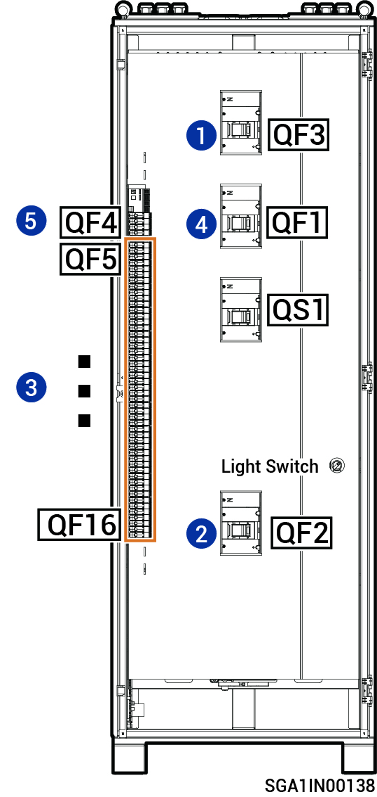

# Sigen Gateway (C180-9, C300-12)

<figure><figcaption></figcaption></figure>



<mark style="color:orange;">Zařízení Gateway by mělo být odpojeno v&nbsp;následujícím pořadí:</mark>

1. <mark style="color:orange;">Vypněte jistič v&nbsp;lisované skříňce QF3 (připojený k&nbsp;zálohovanému spotřebiči).</mark>
2. <mark style="color:orange;">Vypněte jistič v&nbsp;lisované skříňce QF2 (připojený k&nbsp;naftovému generátoru&nbsp;/ inteligentnímu spotřebiči).</mark>
3. <mark style="color:orange;">Po vypnutí měničů přes telefon vypněte jističe v&nbsp;lisované skříňce QF5–QF16 (připojené k&nbsp;měniči).</mark>
4. <mark style="color:orange;">Vypněte jistič v&nbsp;lisované skříňce QF1 (připojený k&nbsp;energetické síti).</mark>
5. <mark style="color:orange;">Vypněte přepínač přepěťového ochranného zařízení QF4.</mark>
