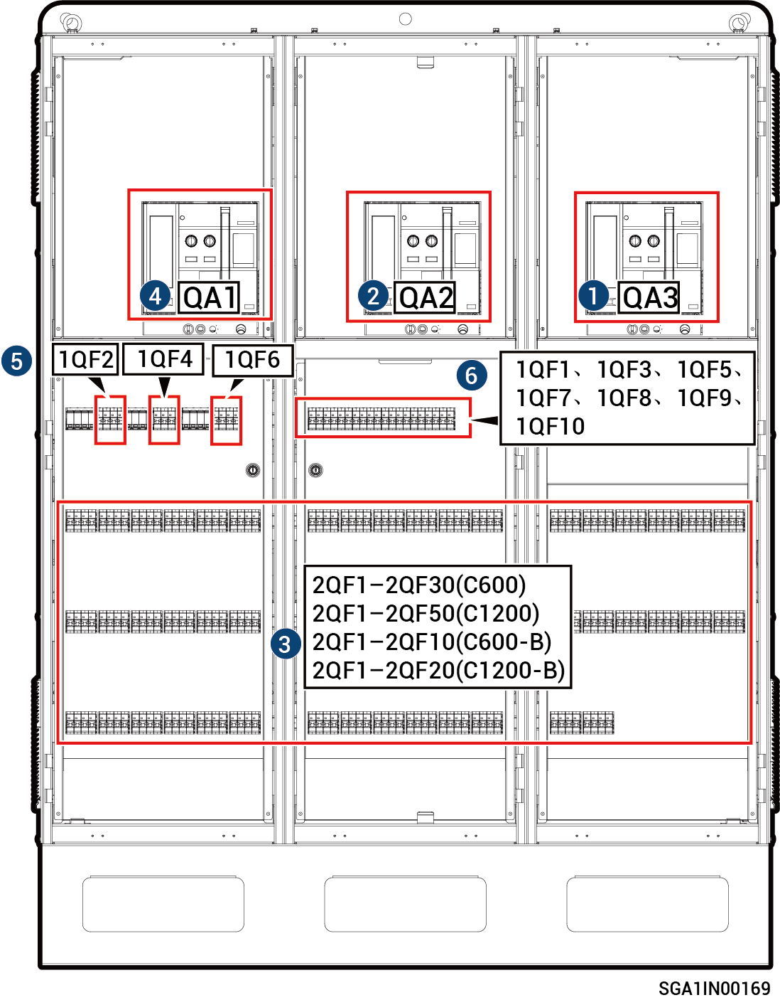

# Sigen Gateway (C600, C1200, C600-B, C1200-B)

<figure><figcaption></figcaption></figure>



<mark style="color:orange;">请按如下顺序分闸：</mark>

1. <mark style="color:orange;">断开框架断路器QA3（连接备电负载）。</mark>
2. <mark style="color:orange;">断开框架断路器QA2（连接智能负载/发电机）。</mark>
3. <mark style="color:orange;">在手机端APP将逆变器关机后，断开断路器（连接逆变器）。</mark>
   * <mark style="color:orange;">C600：断开2QF1\~2QF30（微型断路器）</mark>
   * <mark style="color:orange;">C1200：断开2QF1\~2QF50（微型断路器）</mark>
   * <mark style="color:orange;">C600-B：断开2QF1\~2QF10（塑壳断路器）</mark>
   * <mark style="color:orange;">C1200-B：断开2QF1\~2QF20（塑壳断路器）</mark>
4. <mark style="color:orange;">断开框架断路器QA1（连接电网）。</mark>
5. <mark style="color:orange;">断开防雷器开关1QF2、1QF4、1QF6。</mark>
6. <mark style="color:orange;">断开PCB板二次控制开关1QF1、1QF3、1QF5，断开框架断路器二次控制开关1QF7、1QF8、1QF9、1QF10。</mark>
