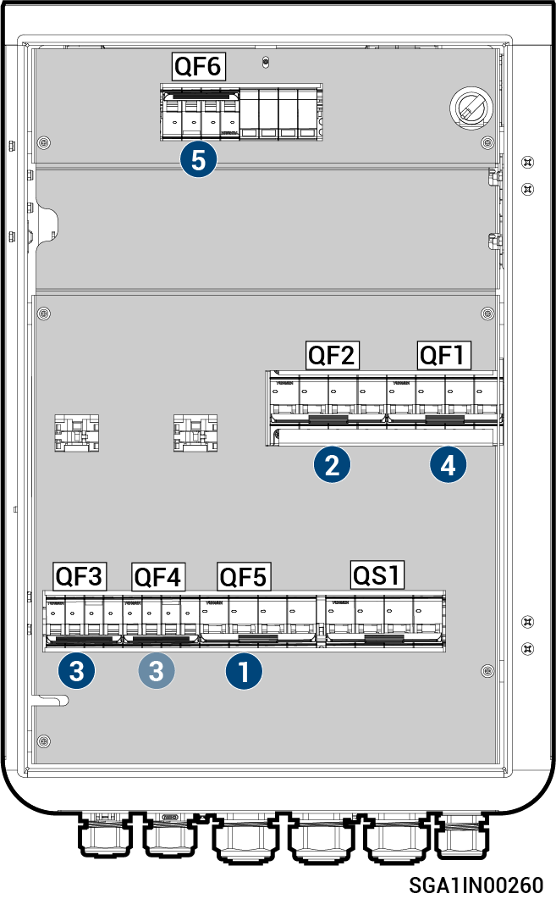

# Sigen Gateway C60-2

<figure><figcaption></figcaption></figure>



<mark style="color:orange;">Das Gateway sollte in der folgenden Reihenfolge getrennt werden:</mark>

1. <mark style="color:orange;">Schalten Sie den Miniatur-Leistungsschutzschalter QF5 aus (angeschlossen an die Notstromlasten).</mark>
2. <mark style="color:orange;">Schalten Sie den Miniatur-Leistungsschutzschalter QF2 aus (Anschluss an intelligente Verbraucher/Generator).</mark>
3. <mark style="color:orange;">Nach dem Abschalten des Wechselrichters über das Telefon schalten Sie die Leitungsschutzschalter QF3 und QF4 (Anschluss an den Wechselrichter) aus.</mark>
4. <mark style="color:orange;">Schalten Sie den Miniatur-Leistungsschutzschalter QF1 aus (Anschluss an das Stromnetz).</mark>
5. <mark style="color:orange;">Schalten Sie den Miniatur-Leistungsschutzschalter QF6 aus (angeschlossen an die Überspannungsschutzvorrichtung).</mark>
