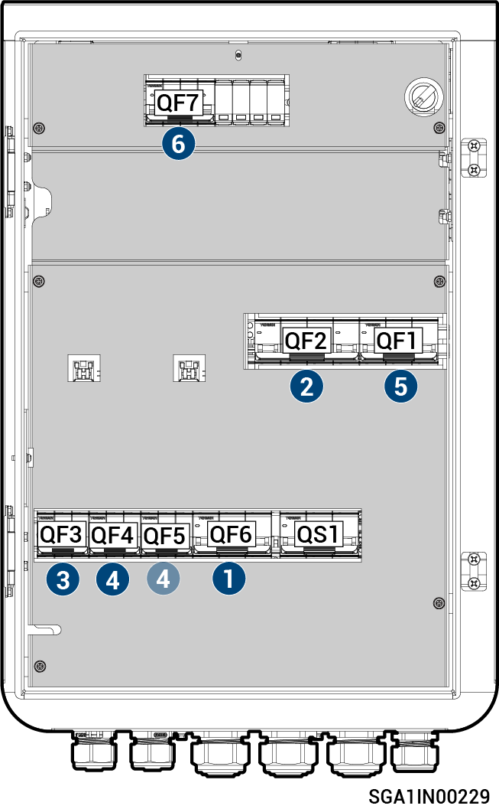

# Sigen Gateway C60 AU

<figure><figcaption></figcaption></figure>



<mark style="color:orange;">Zařízení Gateway by mělo být odpojeno v&nbsp;následujícím pořadí:</mark>

1. <mark style="color:orange;">Vypněte miniaturní jistič QF6 (připojený k&nbsp;zálohovaným spotřebičům).</mark>
2. <mark style="color:orange;">Vypněte miniaturní jistič QF2 (připojený k&nbsp;inteligentním spotřebičům&nbsp;/ generátoru).</mark>
3. <mark style="color:orange;">Po vypnutí všech měničů přes telefon vypněte miniaturní jistič QF3 (připojený k&nbsp;měniči 1).</mark>
4. <mark style="color:orange;">Vypněte miniaturní jistič QF4 nebo QF5 (připojený k&nbsp;měniči 2).</mark>
5. <mark style="color:orange;">Vypněte miniaturní jistič QF1 (připojený k&nbsp;energetické síti).</mark>
6. <mark style="color:orange;">Vypněte miniaturní jistič (připojený k&nbsp;zařízení přepěťové ochrany) QF7.</mark>
