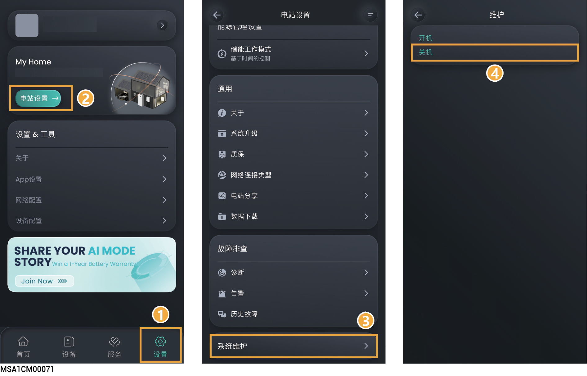

# 系统下电/上电



<mark style="color:red;">高电压、危险：</mark>

<mark style="color:red;">操作设备时，请穿戴绝缘手套、绝缘鞋、安全帽等防护用具。禁止佩戴金属手镯、戒指、项链等导电饰品。</mark>

## 系统下电

1. 通过App，关闭设备。

### **户主账号**

<figure><figcaption></figcaption></figure>

### **安装商账号**

<figure><figcaption></figcaption></figure>

2. 断开备电配电单元内与设备连接的开关。
3. 将设备上的“DC SWITCH”旋转至“OFF”状态。
4. 设备LED指示灯均熄灭后，请参考设备上延时标签，等待对应的时间后，再进行操作。



<mark style="color:orange;">下电后，设备存在残余电流与余热。下电后立马操作，可能会造成触电与灼伤。</mark>

## 系统上电

1. 将设备上的“DC SWITCH”旋转至“ON”状态。
2. 闭合备电配电单元内与设备连接的开关。
3. 通过App，设备开机（操作步骤参见“系统下电”的步骤1描述）。
