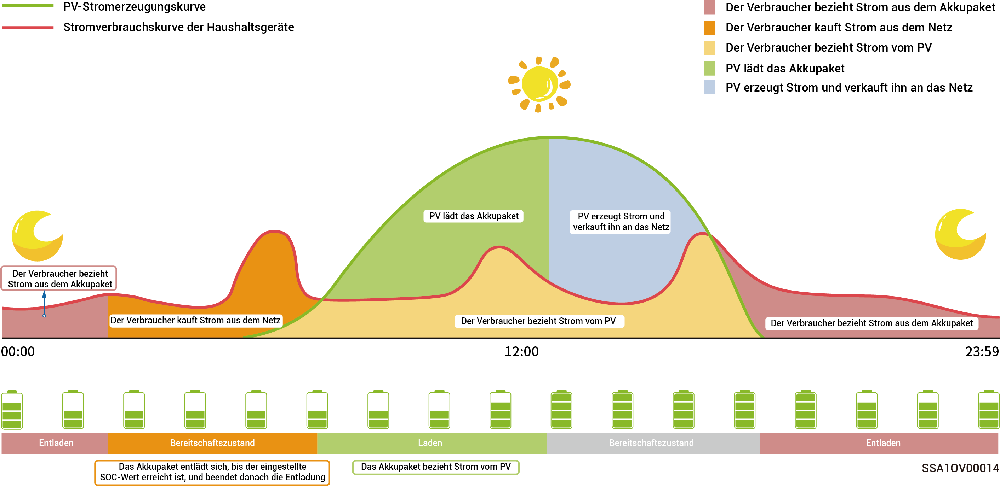

# Notstromeinrichtung



* <mark style="color:blue;">**l Diesen Abschnitt überspringen, wenn kein Gateway konfiguriert ist.**</mark>
* <mark style="color:blue;">**Benutzer können diesen Parameter manuell entsprechend der Stromunterbrechungshäufigkeit in ihrer Region einstellen und die Zeit belassen.**</mark>

Wenn sich ein Gateway in Ihrem Netzwerk befindet, können Sie den „Backup-Reserve“-Wert in der mySigen-App manuell einstellen. Im Netzanschlussmodus wird die Batterie nicht mehr entladen, wenn die SOC-Einstellung für die Notstromversorgung erreicht ist. Bei einem Stromausfall wird die Notstromversorgung verfügbar.

Der SOC für die Notstromversorgung wird beispielsweise im Eigenverbrauchsmodus eingestellt.

<figure><figcaption></figcaption></figure>
