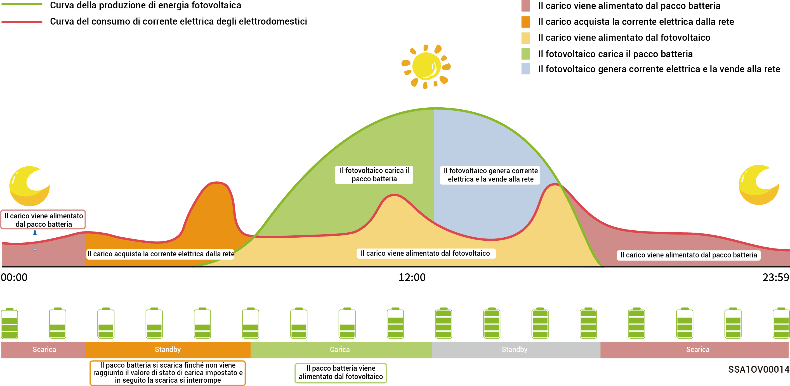

# Impostazione dell'alimentazione di backup



* <mark style="color:blue;">Saltare questa sezione se nessun gateway è configurato.</mark>
* <mark style="color:blue;">Gli utenti possono impostare manualmente questo parametro in base alla frequenza delle interruzioni di corrente nella loro regione e al tempo di attesa.</mark>

Se nel collegamento alla rete è incluso un gateway, l'utente può impostare manualmente il valore della "Riserva di Backup" nell'app mySigen. Nella modalità collegata alla rete, la batteria cessa di scaricarsi quando viene raggiunto lo stato di carica dell'alimentazione di backup impostato. Se si verifica una interruzione di corrente, l'alimentazione di backup diventa disponibile.

Ad esempio, lo stato di carica dell'alimentazione di backup viene impostato nella modalità di autoconsumo.

<figure><figcaption></figcaption></figure>
