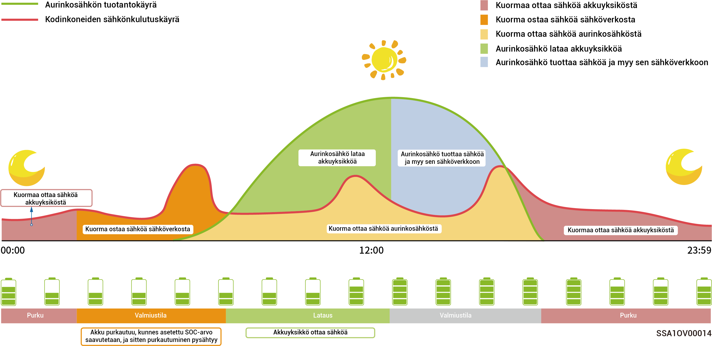

# Varavoiman asettaminen



* <mark style="color:blue;">Ohita tämä osio, jos Gateway-määritystä ei ole tehty.</mark>
* <mark style="color:blue;">Käyttäjät voivat asettaa tämän parametrin manuaalisesti alueensa virrankatkostiheyden ja lähtöajan mukaan.</mark>

Jos verkossa on yhdyskäytävä, voit asettaa ”Backup Reserve” (Varavoima)-arvon manuaalisesti mySigen-sovelluksessa. Verkkoliitäntätilassa akku lakkaa purkautumasta, kun varavoiman SOC-asetus on saavutettu. Verkkovirran katketessa varavoima tulee käyttöön.

Esimerkiksi varavoiman SOC on asetettu omakulutus-tilaan.

<figure><figcaption></figcaption></figure>
