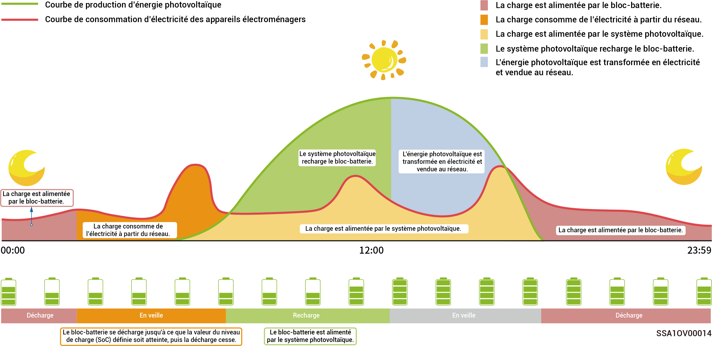

# Configuration de l'alimentation de secours



* <mark style="color:blue;">**Ignorer cette section si aucun Gateway n'est configuré.**</mark>
* <mark style="color:blue;">**Les utilisateurs peuvent fixer manuellement ce paramètre en fonction de la fréquence des coupures d'électricité dans leur région et de la durée de leur absence.**</mark>

En présence d'un Gateway dans votre mise en réseau, il est possible de régler manuellement la valeur « Réserve de secours » dans l'application mySigen. En mode connexion au réseau, la batterie cesse de se décharger lorsque la valeur de niveau de charge (SoC) de l'alimentation de secours est atteinte. En cas de panne du réseau électrique, l'alimentation de secours prend le relais.

Par exemple, le SoC de l'alimentation de secours est réglé en mode autoconsommation.

<figure><figcaption></figcaption></figure>
