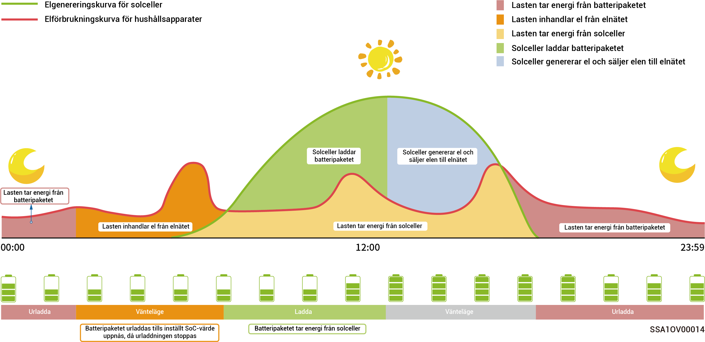

# Konfiguration av reservkraft



* <mark style="color:blue;">**l Hoppa över detta avsnitt om Gateway inte har konfigurerats.**</mark>
* <mark style="color:blue;">**Användare kan ställa in denna parameter manuellt i enlighet med strömavbrottens frekvens i respektive region och lämna tid.**</mark>

Om nätverket räknar med en gateway kan du ställa in värdet för ”Reservkraft” manuellt i mySigen-appen. I nätanslutningsläge slutar batteriet att urladdas när inställningen för reservkraftens SoC uppnås. Vid strömavbrott i elnätet blir reservkraften tillgänglig.

Exempelvis är reservkraftens SoC inställd till självförsörjningsläge.

<figure><figcaption></figcaption></figure>
