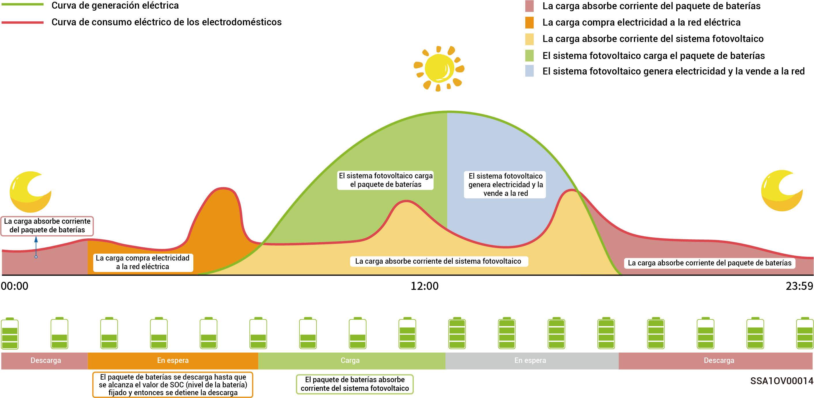

# Configuración de la energía de reserva



* <mark style="color:blue;">**Saltar esta sección si no se ha configurado ninguna gateway.**</mark>
* <mark style="color:blue;">**Los usuarios pueden configurar manualmente este parámetro en función de la frecuencia de cortes de suministro de sus regiones y la duración de las mismas.**</mark>

Si hay una gateway en su red, puede seleccionar manualmente el valor de «Reserva» en la aplicación mySigen. En modo de conexión a la red, la batería deja de descargarse cuando se alcanza del ajuste de SOC de la corriente de emergencia. En caso de apagón de la red eléctrica, la corriente de emergencia pasa a estar disponible.

Por ejemplo, el SOC de la corriente de emergencia se ha fijado en Modo de autoconsumo.

<figure><figcaption></figcaption></figure>
