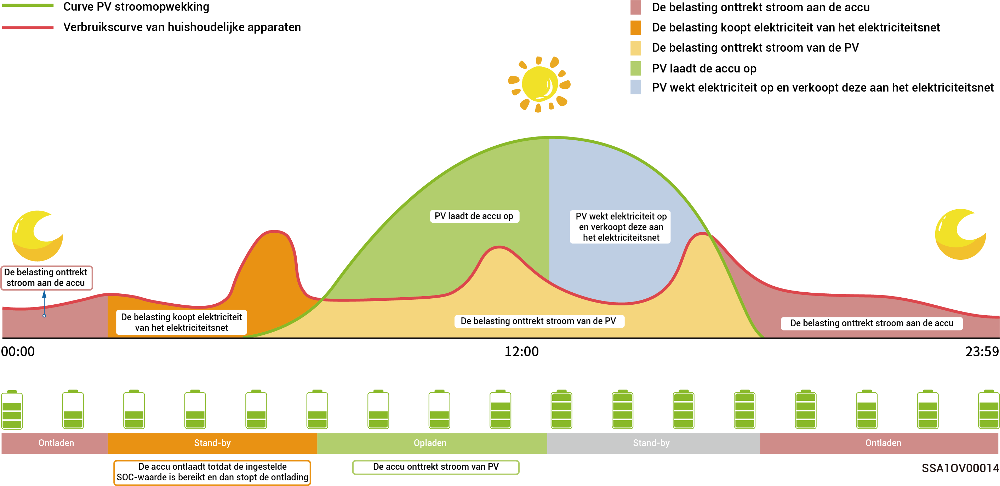

# Instelling back-upvermogen



* <mark style="color:blue;">**l Sla dit gedeelte over als er geen gateway is geconfigureerd.**</mark>
* <mark style="color:blue;">**Gebruikers kunnen deze parameter handmatig instellen op basis van de stroomonderbrekingsfrequentie van hun regio's en verloftijd.**</mark>

Als er een gateway in uw netwerk is, kunt u de waarde "Backup Reserve" handmatig instellen in de mySigen App. In de netkoppelingsmodus stopt de batterij met ontladen wanneer de SOC-instelling voor reservevermogen is bereikt. In het geval van een stroomonderbreking op het elektriciteitsnet, wordt het reservevermogen beschikbaar.

De back-up stroom SOC is bijvoorbeeld ingesteld in Eigen verbruiksmodus.

<figure><figcaption></figcaption></figure>
