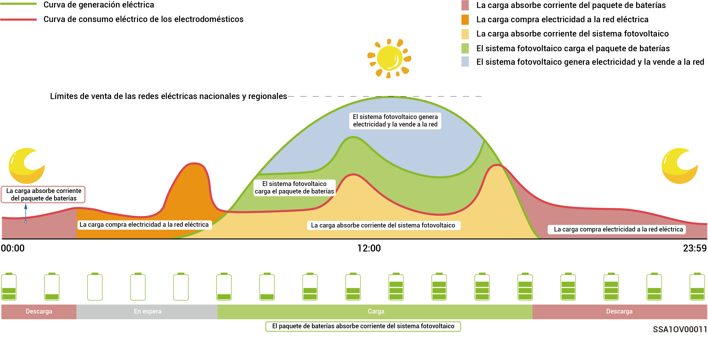
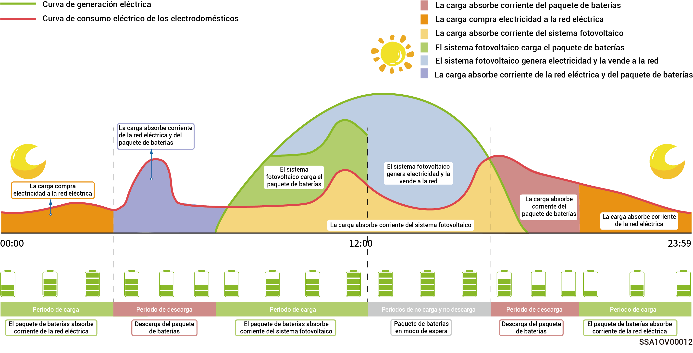

# Modo de trabajo



* <mark style="color:blue;">**El sistema de almacenamiento de energía SigenStor se utiliza principalmente en sistemas de generación eléctrica de tejados domésticos y en sistemas conectados a la red de generadores pequeños de entornos comerciales e industriales.**</mark>
* <mark style="color:blue;">**El sistema de almacenamiento de energía admite distintos modos de trabajo, en concreto: «Modo IA de Sigen», «Modo de autoconsumo», «Modo de control basado en el tiempo», «Modo completamente suministrado a la red», «Modo EMS remoto» y «Modo de desconexión de cargas».**</mark>
* <mark style="color:blue;">**Algunos países admiten el Modo de desconexión de cargas, que está sujeto a la visualización de la interfaz de la aplicación.**</mark>

### **Modo** **IA de Sigen**

A partir de los precios pico y valle locales de la electricidad y los datos meteorológicos, combinados con los hábitos de consumo eléctrico del usuario, el Modo IA de Sigen puede personalizar soluciones de consumo eléctrico inteligente para maximizar el ahorro de costes de los clientes.

<figure><figcaption></figcaption></figure>

### Modo de autoconsumo

* Cuando hay suficiente energía solar, la energía eléctrica generada por el sistema fotovoltaico se utilizará en primer lugar para alimentar las cargas y cualquier excedente se almacenará en las baterías. Cualquier sobrante de energía remanente se venderá a la red. Cuando no hay suficiente energía solar, las baterías liberan energía eléctrica a las cargas. Al aumentar la proporción de autoconsumo del sistema de energía fotovoltaica y mejorar la relación de autosuficiencia de la energía doméstica, puede ahorrar en sus facturas de electricidad de forma efectiva.
* Este modo es adecuado para zonas con precios de la electricidad elevados o restricciones a la conexión a la red con potencia cero.

<figure><figcaption></figcaption></figure>

### Modo de control basado en el tiempo

* Los períodos de carga, descarga y autoconsumo se han de fijar manualmente. Cuando los precios de la electricidad son altos, la energía sobrante de la generación fotovoltaica y de las baterías puede venderse a la red y cargar las baterías durante los períodos de precio bajo de la electricidad, para ahorrar en la factura eléctrica.
* Si no se establece ningún período, el sistema de almacenamiento de energía estará en modo de espera sin descargar. La corriente fotovoltaica priorizará la alimentación de la carga y la energía sobrante se usará para cargar el sistema de almacenamiento de energía.\*
* Pueden fijarse hasta 24 períodos de carga y descarga o autoconsumo.
*   Es adecuado para zonas con precios pico y valle de la electricidad con diferencias de precio significativas.

    Al entrar en este período se registrará la capacidad de la batería. Si la energía fotovoltaica es mayor que la carga, la energía fotovoltaica restante cargará la batería. Si la energía fotovoltaica es menor que la carga, la batería puede descargarse hacia la carga. No obstante, si la capacidad de la batería se reduce y se acerca al valor de capacidad de la batería cuando se entra en este período, la batería dejará de descargarse.

<figure><figcaption></figcaption></figure>

### Modo completamente suministrado a la red

* Puede vender a la red la energía sobrante y obtener créditos en su factura eléctrica.
* Durante el día, si la potencia fotovoltaica es mayor que la capacidad de salida máxima del inversor, este mantiene la salida máxima y almacena la energía sobrante en las baterías. Si la potencia fotovoltaica es menor que la capacidad de salida máxima del inversor o si no hay potencia fotovoltaica durante la noche, las baterías se descargan para asegurar que el inversor maximiza la salida.

### **Modo EMS remoto**

Después de configurarlo en este modo, permitirá a un EMS de terceros programar parámetros relativos a la planta eléctrica y el producto establecidos por la empresa. No entre ni salga de este modo sin la confirmación del instalador.

### **Modo de desconexión de cargas**

En áreas con cortes de suministro frecuentes, puede añadir su región y programar en este modo. El sistema cargará completamente la batería con la antelación programada, garantizando que tendrá batería suficiente disponible para alimentar las cargas durante los cortes. (actualmente solo admitido en Suráfrica)
