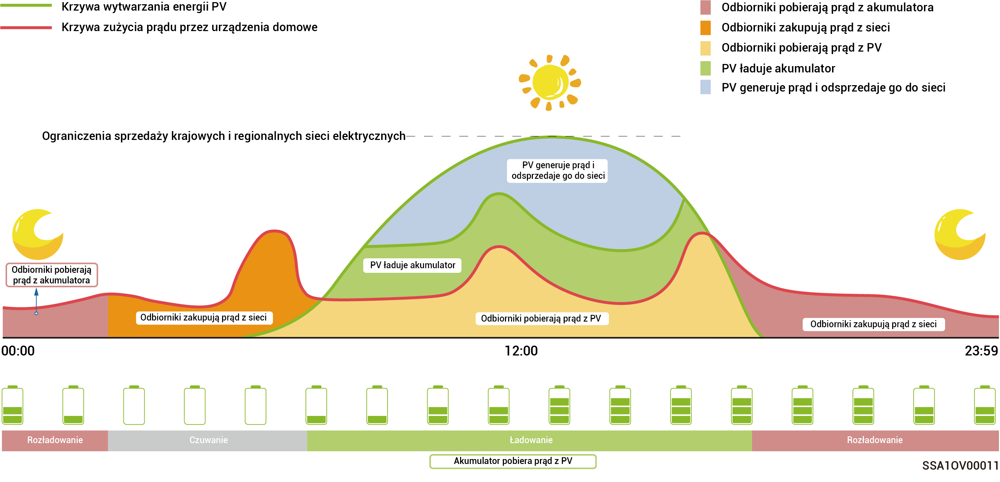
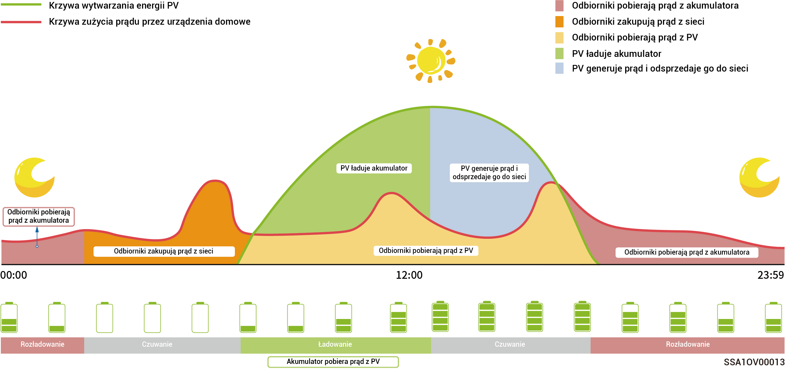
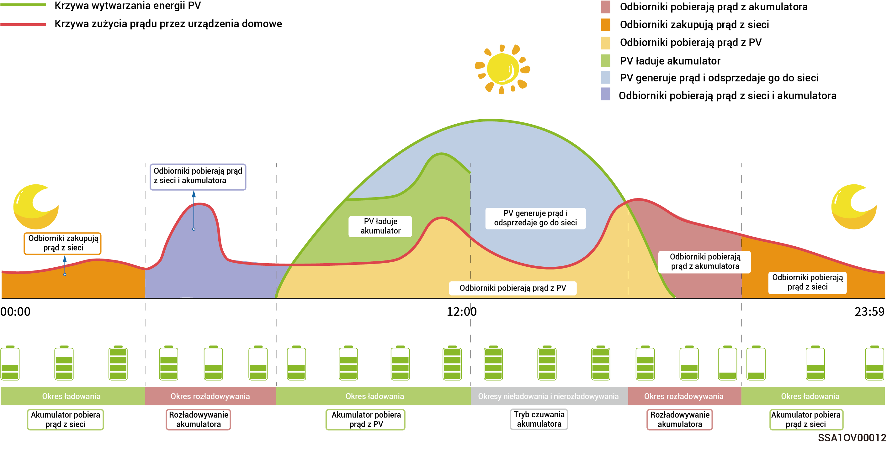

# Tryby pracy



* <mark style="color:blue;">**System magazynowania energii SigenStor jest stosowany głównie w przypadku domowych instalacji dachowych oraz małych instalacji połączonych z siecią w zastosowaniach komercyjnych i przemysłowych.**</mark>
* <mark style="color:blue;">**System magazynowania energii obsługuje wiele trybów pracy, na przykład: „tryb Sigen AI”, „tryb auto-konsumpcji”, „czasowy tryb kontroli”, „tryb nieograniczonego przesyłu do sieci”, „tryb zdalny EMS”, oraz „tryb ograniczania zużycia”.**</mark>
* <mark style="color:blue;">**W niektórych krajach możliwe jest korzystanie z trybu ograniczania zużycia, co należy potwierdzić na ekranie interfejsu aplikacji.**</mark>

### **Tryb** **Sigen AI**

Na podstawie danych o lokalnych cenach energii elektrycznej w godzinach szczytu i spadku cen oraz danych pogodowych, a także nawyków użytkowników w zakresie zużycia energii elektrycznej, tryb Sigen AI może dostosowywać inteligentne rozwiązania dotyczące zużycia energii elektrycznej w celu maksymalizacji oszczędności kosztów ponoszonych przez klientów.

<figure><figcaption></figcaption></figure>

### Tryb auto-konsumpcji

* Gdy energia słoneczna jest wystarczająca, energia elektryczna generowana przez system PV zostanie najpierw wykorzystana do zasilania obciążeń, a nadmiar energii zostanie zmagazynowany w akumulatorach. Wszelka pozostała nadwyżka energii zostanie sprzedana do sieci. Gdy energia słoneczna jest niewystarczająca, akumulatory udostępnią energię elektryczną odbiornikom. Zwiększając współczynnik autokonsumpcji systemu PV i poprawiając współczynnik samowystarczalności energetycznej gospodarstwa domowego, można skutecznie zredukować rachunki za prąd.
* Jest to tryb odpowiedni dla obszarów o wysokich cenach energii elektrycznej lub ograniczeniach dotyczących zerowego eksportu energii do sieci energetycznej.

<figure><figcaption></figcaption></figure>

### Czasowy tryb kontroli

* Okres ładowania, okres rozładowywania i okres autokonsumpcji muszą być ustawione ręcznie. Gdy ceny energii elektrycznej są wysokie, nadwyżka energii z fotowoltaiki i energii akumulatorowej może być sprzedawana do sieci, a akumulator może być ładowany w okresach niskich cen energii elektrycznej, aby zmniejszyć rachunki za prąd.
* Jeśli nie ustawiono żadnego okresu, system magazynowania energii będzie w trybie gotowości bez rozładowywania. Energia fotowoltaiczna będzie priorytetowo zasilać obciążenia, a nadwyżka energii będzie wykorzystywana do ładowania systemu magazynowania energii.
* Można ustawić do 24 okresów ładowania i rozładowywania lub autokonsumpcji.
*   Sprawdzi się w obszarach w których obowiązują inne taryfy w szczycie i okresie niskiego zapotrzebowania na energię, a różnice w cenach są znaczne.

    \*Po wprowadzeniu tego okresu zostanie zarejestrowana pojemność akumulatora. Gdy moc fotowoltaiczna jest większa niż obciążenie, pozostała moc fotowoltaiczna będzie ładować akumulator. Gdy moc fotowoltaiczna jest mniejsza niż obciążenie, akumulator może zostać rozładowany przez odbiorniki. Jednakże, gdy pojemność akumulatora zmniejszy się i zbliży się do wartości pojemności akumulatora w momencie wejścia w ten okres, akumulator przestanie się rozładowywać.

<figure><figcaption></figcaption></figure>

### Tryb nieograniczonego przesyłu do sieci

* Nadwyżkę energii można odsprzedać do sieci i zgromadzić zniżkę do rachunku za energię.
* W ciągu dnia, gdy moc PV jest większa niż maksymalna moc wyjściowa falownika, falownik utrzymuje maksymalną moc wyjściową, jednocześnie przechowując nadmiar energii w akumulatorach. Gdy moc PV jest niższa niż maksymalna moc wyjściowa falownika lub w nocy, gdy energia PV nie jest generowana, akumulatory są rozładowywane, aby zapewnić, że falownik zmaksymalizuje moc wyjściową.

### **Tryb zdalny EMS**

Po ustawieniu tego trybu zewnętrzny system EMS będzie mógł zaplanować parametry związane z instalacją energetyczną i urządzeniem ustawione przez firmę. Nie uruchamiać ani nie wyłączać tego trybu bez zgody instalatora.

### **Tryb ograniczania zużycia**

Na obszarach, na których często dochodzi do przerw w dostawie prądu, można w tym trybie dodać swój region i harmonogram, a system w pełni naładuje akumulator zgodnie z harmonogramem, zapewniając wystarczającą moc do zasilania obciążenia podczas przerw w dostawie prądu. (aktualnie obsługiwany tylko w Południowej Afryce)
