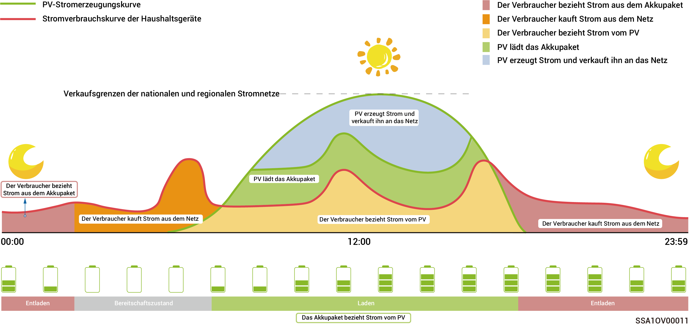
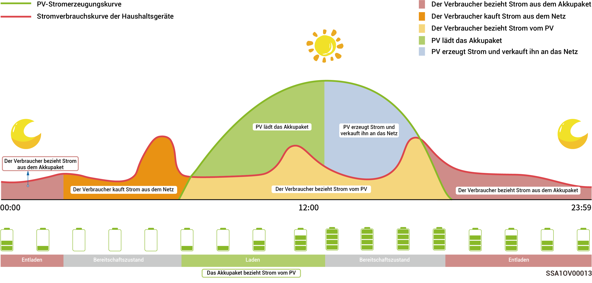
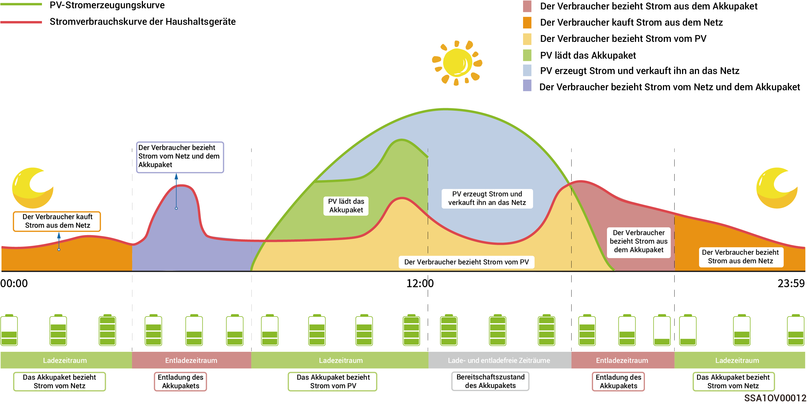

# Betriebsmodus



<mark style="color:blue;">Das Energiespeichersystem unterstützt mehrere Betriebsmodi, einige Länder unterstützen den Lastabwurfmodus und den VPP-Planungsmodus, der von der Anzeige der App-Schnittstelle abhängig ist.</mark>

### **Sigen KI**-**Modus**

Durch die Erfassung lokaler Höchst- und Tiefstpreise für Strom sowie von Wetterdaten in Kombination mit den Stromverbrauchsgewohnheiten der Nutzer kann der Sigen KI-Modus intelligente Lösungen für den Stromverbrauch anpassen, um die Kosteneinsparungen der Kunden zu maximieren.

<figure><figcaption></figcaption></figure>

### **Eigenverbrauchsmodus**

* Bei ausreichender Sonneneinstrahlung wird die von der PV-Anlage erzeugte elektrische Energie zuerst für die Versorgung der Verbraucher genutzt. Überschüssige Energie wird in den Batterien gespeichert. Die überschüssige Energie wird in das Stromnetz eingespeist. Wenn die Sonneneinstrahlung nicht ausreicht, geben die Batterien elektrische Energie an die Verbraucher ab. Durch die Erhöhung des Eigenverbrauchsanteils und die Verbesserung des Autarkieverhältnisses bei der Haushaltsenergie können Sie Ihre Stromkosten effektiv senken.
* Dieser Modus eignet sich für Gebiete mit hohen Strompreisen oder Einschränkungen bei der Netzanbindung ohne Strom.

<figure><figcaption></figcaption></figure>

### **Zeitbasierter Steuerungsmodus**

* Die Ladezeit, Entladezeit und Eigenverbrauchszeit müssen manuell eingestellt werden. Bei hohen Strompreisen kann der überschüssige Strom aus der Photovoltaik-Stromerzeugung und der Batteriestrom an das Netz verkauft werden, und die Batterie kann in Zeiten niedriger Strompreise aufgeladen werden, um Stromkosten zu sparen.
* Wenn kein Zeitraum eingestellt ist, befindet sich die Energiespeichereinheit im Standby-Modus, ohne sich zu entladen. Die Photovoltaik-Energie wird vorrangig zur Versorgung der Last verwendet und die überschüssige Energie wird zum Laden der Energiespeichereinheit verwendet.\*
* Es können bis zu 24 Lade- und Entlade- oder Eigenverbrauchszeiträume eingestellt werden.
* Diese Methode eignet sich für Gebiete mit Höchst- und Tiefststrompreisen und erheblichen Preisunterschieden.

\*Bei Eintritt in diesen Zeitraum wird die Batteriekapazität aufgezeichnet. Wenn die Photovoltaik-Energie größer als die Last ist, wird die verbleibende Photovoltaik-Energie die Batterie aufladen. Wenn die Photovoltaikleistung geringer ist als die Last, kann die Batterie an die Last entladen werden. Wenn jedoch die Batteriekapazität abnimmt und sich dem Wert der Batteriekapazität beim Eintritt in diesen Zeitraum nähert, wird die Batterie nicht mehr entladen.

<figure><figcaption></figcaption></figure>

### **Vollständiger Netzeinspeisungsmodus**

* Sie können überschüssige Energie in das Stromnetz einspeisen und Gutschriften auf Ihrer Stromrechnung erhalten.
* Tagsüber, wenn die PV-Leistung größer ist als die maximale Ausgangsleistung des Wechselrichters, hält der Wechselrichter die maximale Ausgangsleistung aufrecht, während überschüssige Energie in den Batterien gespeichert wird. Wenn die PV-Leistung geringer ist als die maximale Ausgangsleistung des Wechselrichters oder nachts keine PV-Leistung vorhanden ist, werden die Batterien entladen, um sicherzustellen, dass der Wechselrichter die Leistung maximiert.

## VPP-Planung-evergen-Modus

Sobald Ihr Speichersystem bei VPP registriert ist, wird es dem intelligenten Dispatching-Netzwerk angeschlossen. Die App zeigt diesen Modus an und aktiviert ihn automatisch.

### **Ferngesteuerter EMS-Modus**

Nach der Einstellung in diesen Modus kann ein EMS eines Drittanbieters die Parameter des Kraftwerks und das vom Unternehmen eingestellte Produkt planen. Rufen Sie diesen Modus ohne die Bestätigung des Installateurs nicht auf und verlassen Sie ihn nicht.

### **Lastabwurfmodus**

In Gebieten mit häufigen Stromausfällen können Sie in diesem Modus Ihre Region und Ihren Zeitplan hinzufügen. Das System lädt die Batterie wie geplant im Voraus vollständig auf und stellt so sicher, dass Sie während der Stromausfälle über Batteriestrom zur Lastversorgung verfügen. (wird zurzeit in Südafrika nicht unterstützt)
