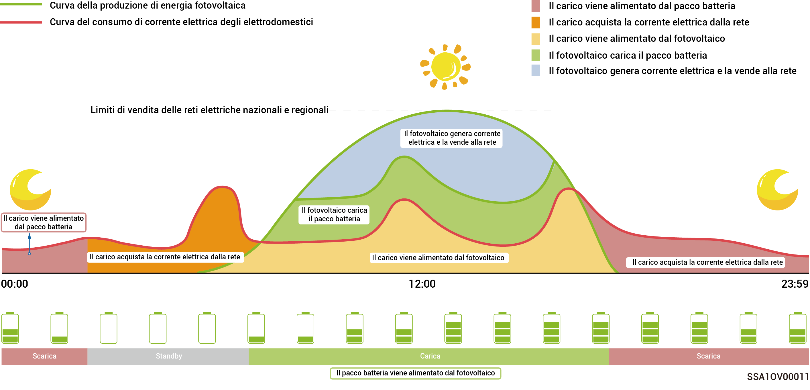
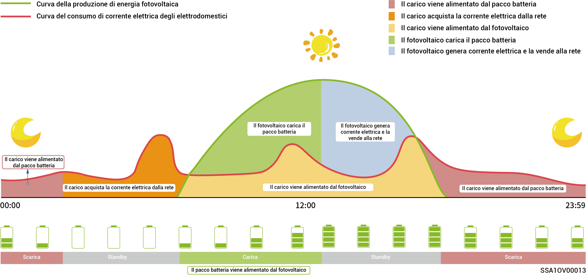
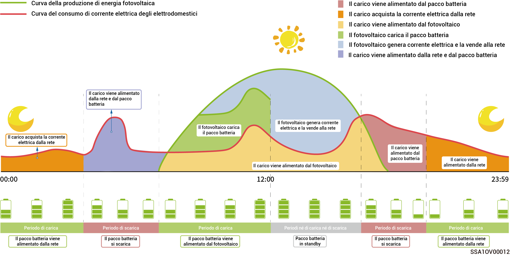

# Modalità di funzionamento



Il sistema di accumulo di energia supporta più modalità di funzionamento; in alcuni paesi sono supportate la Modalità Load Shedding e la Modalità VPP Scheduling-evergen, con riferimento finale all'interfaccia dell'App.

## **Modalità IA Sigen**

Ottenendo i prezzi dell'energia elettrica durante i periodi di alta e bassa domanda, oltre ai dati meteorologici, combinati con le abitudini di consumo della corrente dell'utente, la modalità IA Sigen può offrire soluzioni personalizzate per l'utilizzo intelligente dell'energia elettrica massimizzando il risparmio sui costi per i clienti.

<figure><figcaption></figcaption></figure>

## Modalità autoconsumo

* Quando è disponibile sufficiente energia solare, l'energia elettrica generata dal sistema fotovoltaico sarà in primo luogo usata per alimentare i carichi, l'eventuale energia in eccesso sarà immagazzinata nelle batterie. L'ulteriore energia in eccesso sarà venduta alla rete. Quando non c'è sufficiente energia solare, le batterie rilasceranno l'energia elettrica ai carichi. Aumentando il rapporto di autoconsumo del sistema fotovoltaico e migliorando il rapporto di autosufficienza dell'energia domestica, si può efficacemente risparmiare sulla bolletta elettrica.
* Questa modalità è adatta per le zone dove i prezzi dell'energia elettrica sono elevati o dove sono presenti restrizioni al collegamento alla rete a potenza zero.

<figure><figcaption></figcaption></figure>

## Modalità di controllo basata sul tempo

* I periodi di carica, scarica e di autoconsumo devono essere impostati manualmente. Quando i prezzi dell'energia elettrica sono elevati, l'energia in eccesso generata dal fotovoltaico e l'energia immagazzinata nella batteria può essere venduta alla rete; la batteria può essere caricata durante i periodi in cui i prezzi dell'energia elettrica sono bassi per risparmiare sulle bollette elettriche.
* Se non viene impostato alcun periodo, il sistema di accumulo dell'energia sarà in modalità standby senza scaricarsi. La potenza fotovoltaica darà la priorità all'alimentazione del carico, e la potenza in eccesso sarà utilizzata per caricare il sistema di accumulo dell'energia.
* Possono essere impostati un massimo di 24 periodi di carica e scarica o di autoconsumo.
*   Questa modalità è adatta per le zone con differenze significative tra i prezzi dell'energia elettrica durante i periodi di alta e bassa domanda.

    \*Quando si entra in questo periodo, la capacità della batteria viene registrata. Se la potenza fotovoltaica è maggiore del carico, la potenza rimanente caricherà la batteria. Se la potenza fotovoltaica è minore del carico, la batteria può alimentare il carico scaricandosi. Tuttavia, se la capacità della batteria diminuisce e si avvicina al valore registrato all'ingresso in questo periodo, la batteria interromperà la scarica.

<figure><figcaption></figcaption></figure>

## Modalità completamente immesso in rete

* È possibile rivendere l'energia in eccesso alla rete e ottenere crediti sulla bolletta elettrica.
* Durante il giorno, quando la potenza fotovoltaica supera la massima potenza di uscita dell'inverter, quest'ultimo mantiene la potenza massima in uscita, accumulando l'energia in eccesso nelle batterie. Quando la potenza fotovoltaica è inferiore alla massima potenza di uscita dell'inverter, oppure in assenza di potenza fotovoltaica durante la notte, le batterie vengono scaricate per garantire che l'inverter eroghi la potenza massima.

## **Modalità EMS remoto**

L'impostazione di questa modalità consente a un sistema di gestione dell'energia (EMS) di terze parti di programmare i parametri relativi all'impianto fotovoltaico e al prodotto configurati dal fabbricante. Non attivare o disattivare questa modalità senza il consenso dell'installatore.

## **Modalità riduzione del carico**

Nelle zone in cui si verificano frequenti interruzioni di corrente, si può aggiungere la propria regione e impostare questa modalità affinché il sistema carichi completamente la batteria in anticipo come programmato, garantendo la disponibilità di energia per alimentare il carico durante le interruzioni di corrente. (modalità supportata attualmente solo in Sudafrica)

## VPP Scheduling-evergen Mode

Dopo che il proprietario e l'operatore terziario della centrale elettrica virtuale (VPP) hanno completato il processo di contrattazione o registrazione, il vostro sistema di accumulo di energia verrà connesso alla rete di dispatching intelligente della centrale elettrica virtuale (VPP); l'interfaccia dell'App mostrerà questa modalità e la selezionerà automaticamente.
