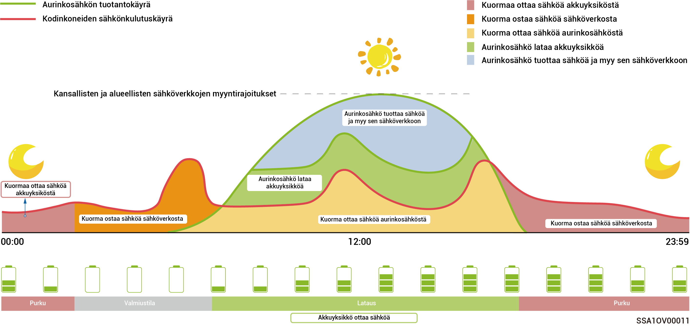
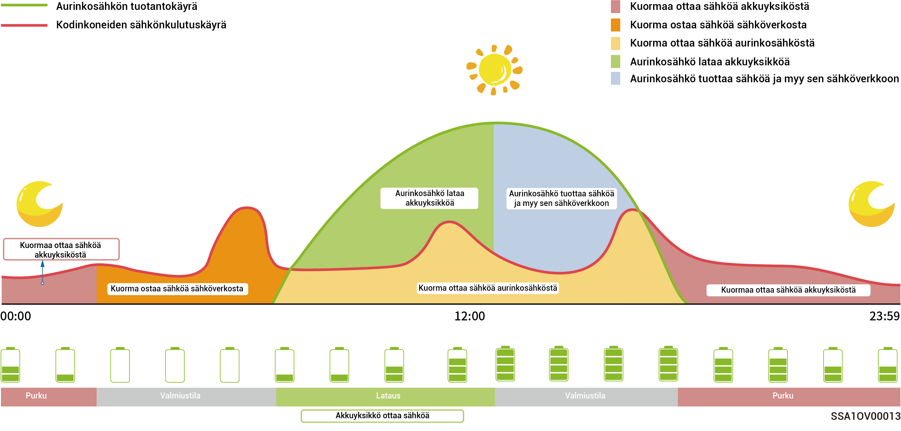
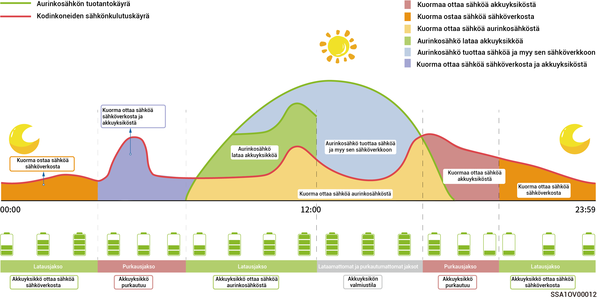

# Käyttötila



<mark style="color:blue;">Energian varastointijärjestelmä tukee useita käyttötiloja. Jotkin maat tukevat kuormien erottamistilaa ja VPP-aikataulutusta – evergen-tila, jotka näkyvät sovelluksen käyttöliittymässä.</mark>

## **Sigen AI** -**tila**

Hankkimalla paikalliset sähkön huippuhinnat ja alimmat hinnat sekä säätiedot ja käyttäjien sähkönkulutustottumukset Sigen AI -tila voi räätälöidä älykkäitä sähkönkäyttöratkaisuja asiakkaiden kustannussäästöjen maksimoimiseksi.

<figure><figcaption></figcaption></figure>

## **Omakulutus-tila**

* Kun aurinkovoimaa on riittävästi, aurinkopaneelijärjestelmän tuottama sähköenergia käytetään ensin kuormien virransyöttöön ja ylimääräinen energia varastoidaan akkuihin. Jäljelle jäävä ylimääräinen energia myydään sähköverkkoon. Kun aurinkovoimaa ei ole riittävästi, akut vapauttavat sähköenergiaa kuormille. Nostamalla aurinkosähköjärjestelmän omakulutusastetta ja parantamalla kotitalouksien energian omavaraisuusastetta voit tehokkaasti säästää sähkölaskuissasi.
* Tämä tila sopii alueille, joilla on korkeat sähkönhinnat tai nollatehoiseen verkkoon liittymisessä rajoituksia.

<figure><figcaption></figcaption></figure>

## **Aikaan perustuva ohjaustila**

* Latausjakso, purkausjakso ja oma kulutusjakso on asetettava manuaalisesti. Kun sähkön hinta on korkea, aurinkosähköjärjestelmän ja akun ylimääräinen energia voidaan myydä verkkoon. Akku voidaan ladata sähkön hinnan ollessa alhainen, jolloin säästät sähkölaskussa.
* Jos jaksoja ei ole asetettu, energian varastointijärjestelmä on valmiustilassa purkautumatta. Aurinkosähkö antaa etusijan kuormien syöttämiselle ja ylijäämäenergia käytetään energian varastointijärjestelmän lataamiseen.\*
* Lataus-, purkaus- tai omakulutusjaksoja voidaan asettaa enintään 24.
* Tämä sopii alueille, joilla on sähkön hintapiikkejä ja laskuja ja merkittäviä hintaeroja.
* Tämän jakson alkaessa akun kapasiteetti tallennetaan. Kun aurinkosähköteho on suurempi kuin kuorma, jäljellä oleva aurinkosähköteho lataa akkua. Kun aurinkosähköteho on pienempi kuin kuorma, akkua voidaan purkaa kuormaan. Kun akun kapasiteetti kuitenkin pienenee ja lähestyy tämän jakson alkaessa asetettua akun kapasiteetin arvoa, akun purkautuminen pysähtyy.

<figure><figcaption></figcaption></figure>

## **Täysin syötetty verkkoon -tila**

* Voit myydä ylimääräisen energian takaisin verkkoon ja saada hyvityksiä sähkölaskuusi.
* Päivällä, kun aurinkovoiman teho on suurempi kuin invertterin enimmäislähtöteho, invertteri ylläpitää enimmäislähtötehoa ja varastoi ylimääräisen energian akkuihin. Kun aurinkovoiman teho on pienempi kuin invertterin enimmäislähtöteho tai yöllä ei ole aurinkosähköä, akut purkautuvat, jotta invertteri voi maksimoida lähtötehon.

## **Etä-EMS-tila**

Kun tämä tila on asetettu, kolmannen osapuolen EMS voi ajoittaa parametrit, jotka liittyvät voimalaan ja yrityksen asettamaan tuotteeseen. Älä siirry tähän tilaan tai poistu siitä ilman asentajan vahvistusta.

## **Kuorman erottamistila**

Alueilla, joilla sähkökatkokset ovat yleisiä, voit lisätä alueesi ja aikataulun tähän tilaan, jolloin järjestelmä lataa akun täyteen etukäteen aikataulun mukaisesti ja varmistaa, että akussa on virtaa kuorman kattamiseen sähkökatkosten aikana. (tällä hetkellä tuettu vain Etelä-Afrikassa)

## VPP-aikataulutus – evergen-tila

Kun tallennusjärjestelmä on rekisteröity VPP:hen, se liittyy älykkääseen jakeluverkkoon. Sovellus näyttää tämän tilan ja ottaa sen automaattisesti käyttöön.
