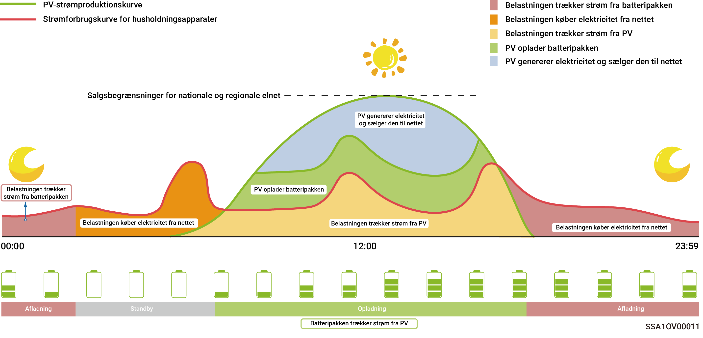
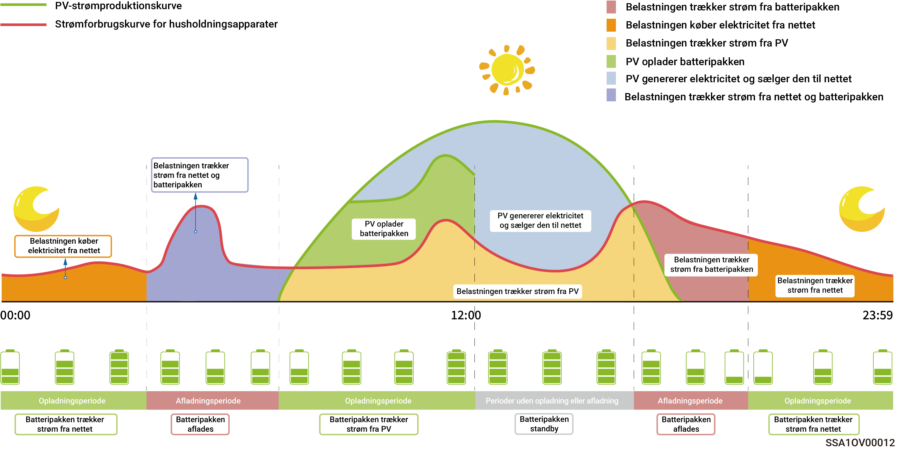

# Driftstilstand



<mark style="color:blue;">Energilagringssystemet understøtter flere arbejdsmodi. Nogle lande understøtter Load Shedding Mode og VPP‑planlægning‑Evergen‑tilstand, som er afhængig af app-grænsefladens display.</mark>

## **Sigen AI**\*\*-tilstand\*\*

Ved at indhente lokale spids- og lav-belastningspriser samt vejrdata og kombinere dem med brugerens forbrugsmønstre kan Sigen AI‑tilstand tilpasse intelligente løsninger til elforbrug for at maksimere kundernes omkostningsbesparelser.

<figure><figcaption></figcaption></figure>

## **Selvforbrugstilstand**

* Når der er tilstrækkelig solenergi, vil den elektriske energi, der genereres af solcelleanlægget, først blive brugt til at forsyne forbrugerne, og overskydende energi vil blive lagret i batterierne. Eventuel overskydende energi vil blive solgt til elnettet. Når der er utilstrækkelig solenergi, vil batterierne afgive elektrisk energi til belastninger. Ved at øge solcelleanlæggets egenforbrugsandel og forbedre husholdningens selvforsyningsgrad med energi kan du effektivt spare på dine elregninger.
* Denne tilstand er velegnet til områder med høje elpriser eller begrænsninger for nettilslutning uden effektudveksling.

<figure><figcaption></figcaption></figure>

## **Tidsbaseret kontroltilstand**

* Opladningsperioden, afladningsperioden og egenforbrugsperioden skal indstilles manuelt. Når elpriserne er høje, kan overskydende strøm fra solcelleanlæg og batteristrøm sælges til elnettet, og batteriet kan oplades i perioder med lave elpriser for at spare på elregningen.
* Hvis der ikke er indstillet nogen periode, vil energilagringssystemet være i standbytilstand uden afladning. Solcelleenergien vil prioritere at forsyne belastningen, og overskydende energi vil blive brugt til at oplade energilagringssystemet.\*
* Der kan indstilles op til 24 opladnings- og afladnings- eller egenforbrugsperioder.
* Det er velegnet til områder med spidsbelastnings- og dalpriser på elektricitet og betydelige prisforskelle.
* Når denne periode påbegyndes, registreres batterikapaciteten. Når den fotovoltaiske effekt er større end belastningen, oplader den resterende fotovoltaiske effekt batteriet. Når solcelleeffekten er mindre end belastningen, kan batteriet aflades til belastningen. Når batterikapaciteten falder og nærmer sig batterikapacitetsværdien ved indgangen til denne periode, vil batteriet dog stoppe med at aflade.

<figure><figcaption></figcaption></figure>

## **Fuldt fødet til netmodus**

* Du kan sælge overskydende energi tilbage til elnettet og tjene kreditter på din elregning.
* Om dagen, når PV-effekten er større end inverterens maksimale udgangskapacitet, opretholder inverteren den maksimale udgang, mens overskydende energi lagres i batterierne. Når PV-effekten er lavere end inverterens maksimale udgangskapacitet, eller der ikke er nogen PV-effekt om natten, aflades batterierne for at sikre, at inverteren maksimerer udgangen.

## **Fjernbetjent EMS-tilstand**

Når denne tilstand er indstillet, kan en tredjeparts EMS planlægge parametre relateret til kraftværket og det produkt, der er indstillet af virksomheden. Indtast eller forlad ikke denne tilstand uden installatørens bekræftelse.

## **Load Shedding‑tilstand**

I områder med hyppige strømafbrydelser kan du tilføje din region og planlægge i denne tilstand, og systemet vil oplade batteriet fuldt ud på forhånd som planlagt, så du er sikker på at have batteristrøm til rådighed til at forsyne belastningen under strømafbrydelser. (understøttes i øjeblikket kun i Sydafrika)

## VPP‑planlægning‑Evergen‑tilstand

Når du er registreret hos VPP, bliver dit lagringssystem en del af det intelligente distributionsnetværk. Appen viser og aktiverer automatisk denne tilstand.
