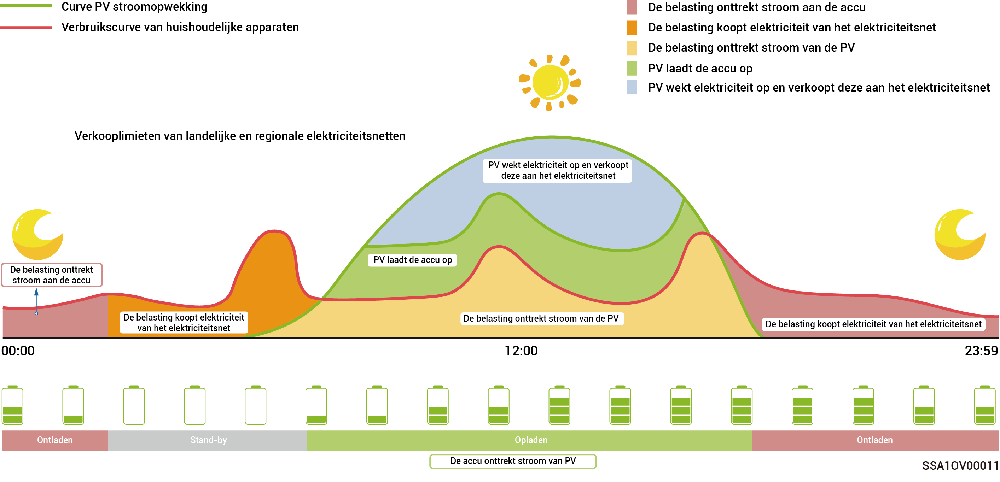
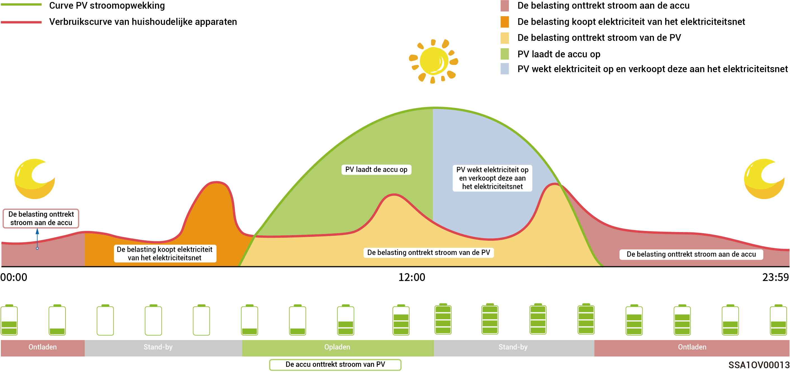
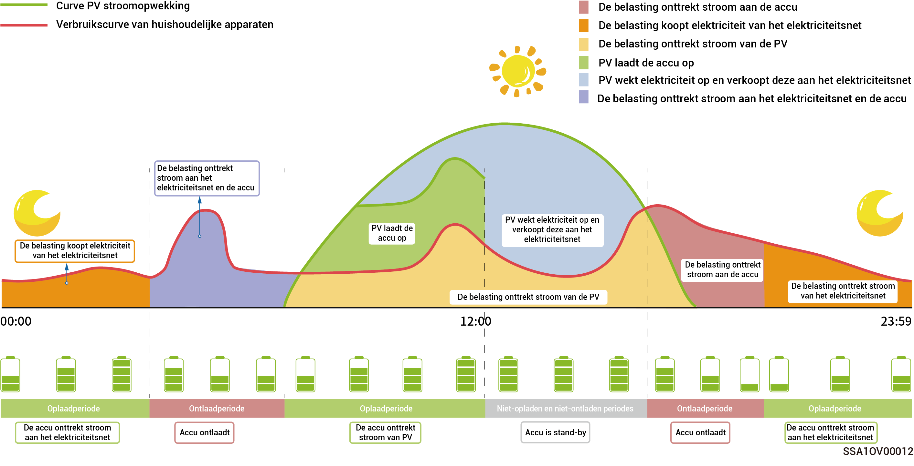

# Werkmodus



* <mark style="color:blue;">**Het SigenStor energieopslagsysteem wordt voornamelijk gebruikt in huishoudelijke dakenergiesystemen en kleine netgekoppelde elektriciteitscentrales in C\&I-scenario's.**</mark>
* <mark style="color:blue;">**Het energieopslagsysteem ondersteunt verschillende werkmodi, namelijk: "Sigen AI-modus", "Eigen verbruiksmodus", "Tijdgestuurde controle-modus", "Modus Volledig naar het net", "EMS-modus op afstand", en "Ladinguitvalmodus".**</mark>
* <mark style="color:blue;">**Sommige landen ondersteunen de Ladinguitvalmodus, die afhankelijk is van de weergave in de app-interface.**</mark>

### **Sigen AI**-**modus**

Door de elektriciteitsprijzen van lokale piek- en daluren en weersdata te verzamelen en deze te combineren met de elektriciteitsverbruikgewoonten van de gebruiker, kan de Sigen AI-modus slimme oplossingen voor elektriciteitsverbruik aanbieden om de kostenbesparingen voor klanten te maximaliseren.

<figure><figcaption></figcaption></figure>

### Eigen verbruiksmodus

* Wanneer er voldoende zonne-energie is, wordt de elektriciteit die door het PV-systeem wordt opgewekt eerst gebruikt om de belasting van stroom te voorzien, en het overschot wordt in de batterijen opgeslagen. Eventuele resterende overtollige energie wordt aan het net verkocht. Bij onvoldoende zonne-energie zullen de batterijen elektriciteit aan de belasting leveren. Door de zelfverbruikratio van het PV-systeem te verhogen en de zelfvoorzieningsgraad van huishoudenergie te verbeteren, kunt u effectief besparen op uw elektriciteitsrekening.
* Deze modus is geschikt voor gebieden met hoge elektriciteitsprijzen of netaansluitbeperkingen zonder stroom.

<figure><figcaption></figcaption></figure>

### Tijdgestuurde controle-modus

* De oplaadperiode, ontlaadperiode en zelfverbruikperiode moeten handmatig worden ingesteld. Wanneer de elektriciteitsprijzen hoog zijn, kan het overschot aan energie van fotovoltaïsche energieopwekking en batterijvermogen worden verkocht aan het elektriciteitsnet en kan de batterij worden opgeladen tijdens perioden met lage elektriciteitsprijzen om te besparen.
* Als er geen periode is ingesteld, zal het energieopslagsysteem in stand-by modus staan zonder te ontladen. De fotovoltaïsche energie zal prioriteit geven aan het voeden van de belasting en het overschot aan energie zal gebruikt worden voor het opladen van het energieopslagsysteem.
* Er kunnen maximaal 24 laad- en ontlaadperioden of perioden van zelfverbruik worden ingesteld.
*   Het is geschikt voor gebieden met piek- en dalprijzen voor elektriciteit en aanzienlijke prijsverschillen.

    \*Bij het invoeren van deze periode wordt de accucapaciteit geregistreerd. Wanneer het fotovoltaïsche vermogen groter is dan de belasting, zal het resterende fotovoltaïsche vermogen de accu opladen. Wanneer het fotovoltaïsche vermogen kleiner is dan de belasting, kan de accu tot de belasting worden ontladen. Wanneer de accucapaciteit echter afneemt en de waarde van de accucapaciteit benadert wanneer deze periode wordt ingegaan, stopt de accu met ontladen.

<figure><figcaption></figcaption></figure>

### Modus Volledig naar het net

* U kunt overtollige energie terugverkopen aan het elektriciteitsnet en credits verdienen op uw energierekening.
* Overdag, wanneer het PV-vermogen groter is dan de maximale uitgangscapaciteit van de omvormer, handhaaft de omvormer het maximale vermogen terwijl het overschot aan energie in de accu's wordt opgeslagen. Als het PV-vermogen lager is dan de maximale uitgangscapaciteit van de omvormer of als er 's nachts geen PV-vermogen is, worden de accu's ontladen om ervoor te zorgen dat de omvormer het maximale vermogen levert.

### **EMS-modus op afstand**

Na het instellen van deze modus kan een derde partij EMS parameters plannen met betrekking tot de centrale en het product dat door het bedrijf is ingesteld. Schakel deze modus niet in of uit zonder bevestiging van de installateur.

### **Ladinguitvalmodus**

In gebieden met frequente stroomonderbrekingen kunt u uw regio en planning in deze modus toevoegen en het systeem zal volgens planning de batterij op voorhand volledig opladen, zodat u zeker bent dat u batterijvermogen beschikbaar heeft om de belasting te voorzien tijdens onderbrekingen. (op dit moment alleen beschikbaar in Zuid-Afrika)
