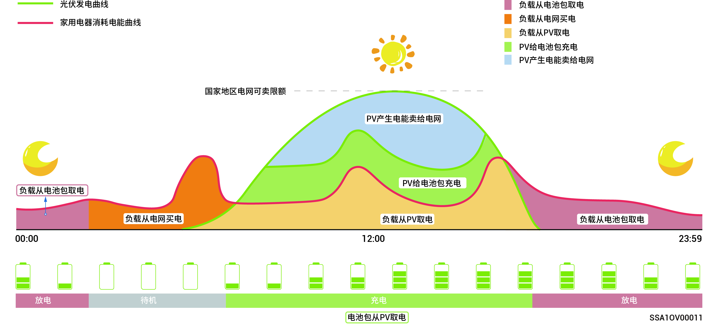
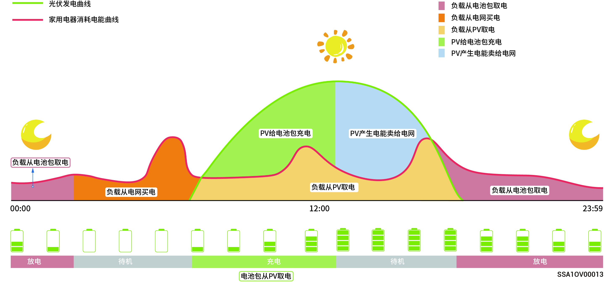

# 工作模式



<mark style="color:blue;">储能系统支持多种工作模式，部分国家支持Load Shedding mode，VPP Scheduling-evergen以App界面显示为准。</mark>

### **Sigen AI模式**

通过获取当地波峰波谷电价、天气数据，结合用户用电习惯，SigenAI模式可定制智能用电解决方案，最大程度为客户节约用电成本。

<figure><figcaption></figcaption></figure>

### **最大自发自用模式**

* 当太阳能充足时，光伏系统产生的电能将优先供给负载，剩余电能存储在电池中，再余电能卖给电网。当太阳能不足时，电池会释放电能供给负载。提高光伏系统的自发自用率和家庭能源自给自足率，可节省电费支出。
* 该模式适用于电价较高或有零功率并网限制的区域。

<figure><figcaption></figcaption></figure>

### **基于时间的控制模式**

* 需要手动设置充电时段、放电时段和自发自用时段。在电价较高时光伏发电的剩余电力和电池电力可以卖给电网，在电网低电价时段给电池充电，可节省电费支出。
* 未设置时间段储能待机不放电，光伏优先供给负载，余电供给储能充电\*。
* 最多可以设置24个充放电或自发自用时间段。
* 适用于峰谷电价且价差较大的区域。

\*进入该时段时，会记录电池电量，当光伏功率大于负载时，剩余光伏功率给电池充电，当光伏功率小于负载时，电池可以放电给负载，但是电池电量下降并且接近进入该时段时的电池电量值时，电池会结束放电。

<figure><figcaption></figcaption></figure>

### **全部发送给电网模式**

* 可使光伏发电最大化卖给电网。
* 白天光伏发电功率＞逆变器的最大输出能力时，逆变器保持最大输出，同时将多余电量存储在电池中；当光伏发电功率＜逆变器最大输出能力或夜间无光伏发电时，电池放电，确保逆变器能够最大化输出。

### VPP Scheduling-evergen Mode

业主和第三方虚拟电厂运营商（VPP）完成签约或注册流程后，你的储能系统将接入虚拟电厂（VPP）智能调度网络，App界面显示该模式并自动选中。

### **远程EMS调度模式**

设置为本模式后，将允许第三方EMS调度公司设置电站及产品的相关参数。未经安装商确认，请勿进入或退出此模式。

### Load Shedding Mode

对于经常停电的地区，您可使用本模式添加地区与计划时间表，系统将根据时间表提前将电池电量充满，确保停电时，您可使用电池电量为负载供电。(目前只支持南非地区)
