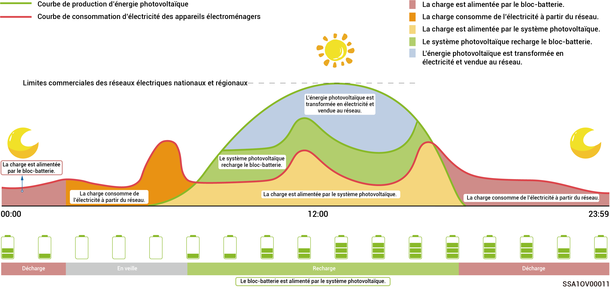
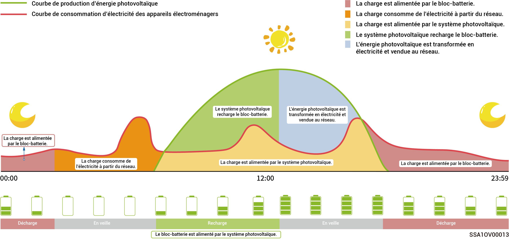
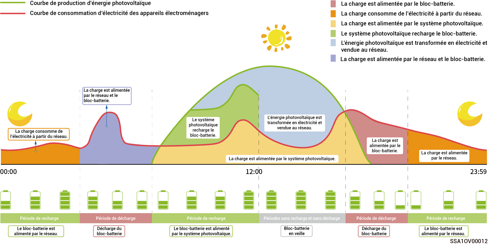

# Mode de fonctionnement



* <mark style="color:blue;">**Le système de stockage d'énergie SigenStor est principalement adapté aux systèmes de centrales électriques domestiques sur toit et aux systèmes de petites centrales électriques en réseau dans le cadre de scénarios commerciaux et industriels.**</mark>
* <mark style="color:blue;">**Le système de stockage d'énergie offre plusieurs modes de fonctionnement, à savoir : « mode IA Sigen », « mode autoconsommation », « mode de contrôle temporel », « mode entièrement alimenté par le réseau », « mode EMS distant » et « mode délestage des charges ».**</mark>
* <mark style="color:blue;">**Certains pays prennent en charge le mode délestage des charges qui dépend de l'affichage de l'interface de l'application.**</mark>

### **Mode IA** **Sigen**

En se basant sur les données météorologiques et les prix de l'électricité aux heures de pointe et aux heures creuses, ainsi que sur les habitudes de consommation d'électricité des usagers, le mode IA Sigen permet de personnaliser des solutions intelligentes de consommation d'électricité afin de réduire au maximum les coûts pour les clients.

<figure><figcaption></figcaption></figure>

### Mode autoconsommation

* Si l'énergie solaire est suffisante, l'énergie électrique produite par le système photovoltaïque sera d'abord utilisée pour alimenter les charges, le surplus d'énergie étant stockée dans les batteries. Tout surplus d'énergie sera vendu au réseau. Dès que l'énergie solaire est insuffisante, les batteries alimentent les charges en énergie électrique. En augmentant le taux d'autoconsommation du système photovoltaïque et en améliorant le taux d'autosuffisance de l'énergie domestique, vous pouvez effectivement réaliser des économies sur vos factures d'électricité.
* Ce mode est adapté aux régions où les prix de l'électricité sont élevés ou dans lesquelles il n'existe aucune restriction en matière de connexion au réseau électrique sans consommation d'énergie.

<figure><figcaption></figcaption></figure>

### Mode contrôle temporel

* Les périodes de recharge, de décharge et d'autoconsommation doivent être définies manuellement. Lorsque les prix de l'électricité sont élevés, le surplus d'énergie produite par le système photovoltaïque et stocker dans la batterie peut être vendu au réseau. La batterie peut également être rechargée pendant les périodes où les prix de l'électricité sont bas, ce qui permet de réduire les factures d'électricité.
* Si aucune période n'est définie, le système de stockage d'énergie sera en mode veille sans décharge. L'énergie photovoltaïque alimentera en priorité la charge. Le surplus d'énergie permettra de charger le système de stockage d'énergie.
* Il est possible de définir jusqu'à 24 périodes de charge et de décharge ou d'autoconsommation.
*   Ce mode est adapté aux zones où les prix de l'électricité sont définis selon les heures creuses et les heures de pointe et où les écarts de prix sont importants.

    \* Au cours de cette période, la capacité de la batterie est enregistrée. Dès que l'énergie photovoltaïque devient supérieure à la charge, l'énergie photovoltaïque restante recharge la batterie. Dès que l'énergie photovoltaïque devient inférieure à la charge, la batterie prend le relais et alimente la charge. Néanmoins, lorsque la capacité de la batterie diminue et se rapproche de la valeur de la capacité de la batterie enregistrée lors de cette période, la décharge de la batterie est interrompue.

<figure><figcaption></figcaption></figure>

### Mode entièrement alimenté par le réseau

* Il est possible de revendre le surplus d'énergie au réseau et d'obtenir des crédits sur sa facture d'énergie.
* Pendant la journée, lorsque l'énergie photovoltaïque est supérieure à la capacité de sortie maximale de l'onduleur, l'onduleur assure la puissance de sortie maximale tout en stockant le surplus d'énergie dans les batteries. Dès que l'énergie photovoltaïque devient inférieure à la capacité de sortie maximale de l'onduleur ou en l'absence d'énergie photovoltaïque pendant la nuit, les batteries sont déchargées pour permettre à l'onduleur de maximiser la puissance de sortie.

### **Mode EMS distant**

Ce mode permet à un système de gestion d'énergie (EMS) tiers de programmer les paramètres liés à la centrale électrique et au produit défini par la société. Ne pas activer ou désactiver ce mode sans la confirmation de l'installateur.

### **Mode délestage des charges**

Dans les régions où les coupures électriques sont fréquentes, ce mode vous permet d'ajouter votre région et vos horaires. Le système chargera donc complètement la batterie à l'avance comme programmé, garantissant ainsi la disponibilité de la batterie pour alimenter la charge en cas de coupure électrique. (Disponible pour l'instant uniquement en Afrique du Sud)
