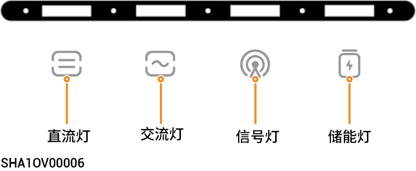
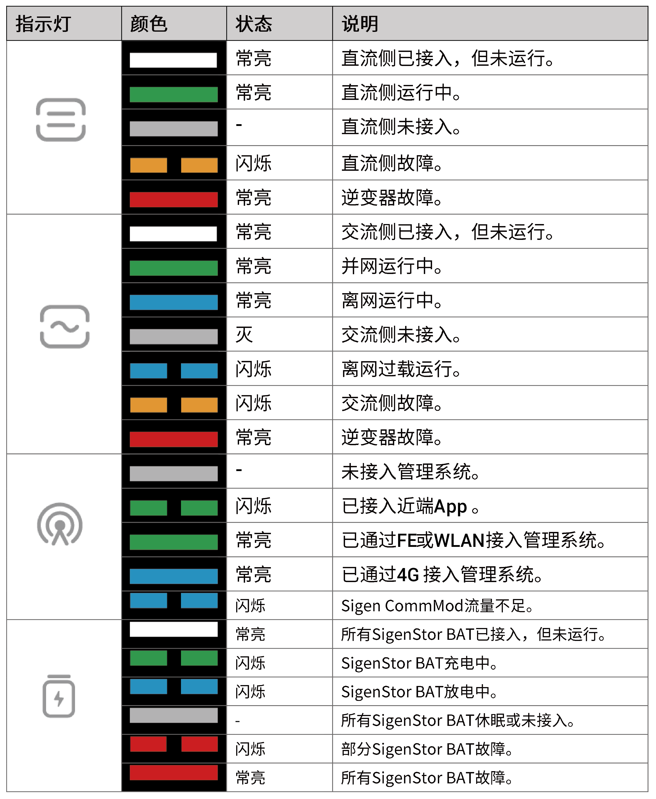
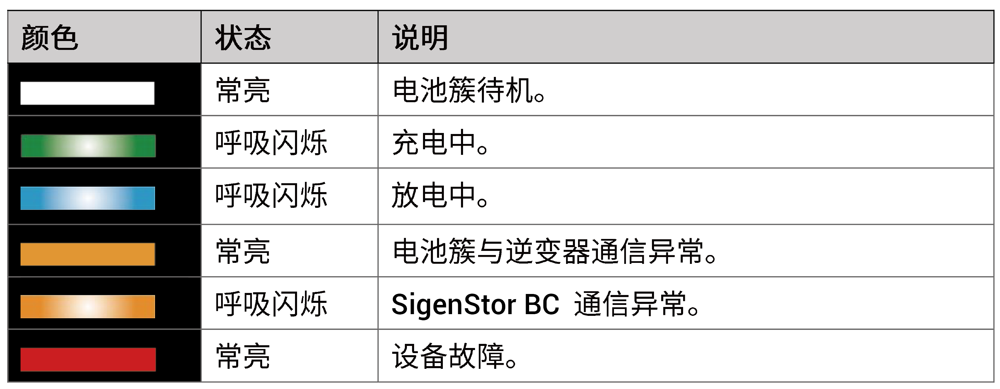

# LED指示灯状态

## **逆变器**

<figure><figcaption></figcaption></figure>

## **SigenStor储能系统**



<mark style="color:blue;">指示灯根据电池簇实时电量及状态显示。</mark>

<figure><figcaption></figcaption></figure>

<figure><figcaption></figcaption></figure>

## **CommMod指示灯**

<figure><figcaption></figcaption></figure>

<table><thead><tr><th width="80" align="center">序号</th><th width="138">名称</th><th width="330">状态</th><th>说明</th></tr></thead><tbody><tr><td align="center">1</td><td>电源灯</td><td>-</td><td>-</td></tr><tr><td align="center">2</td><td>网络状态灯</td><td><ul><li>慢闪（200ms亮/1800ms灭）</li><li>慢闪（1800ms亮/200ms灭）</li><li>快闪（125ms亮/125ms灭）</li></ul></td><td><ul><li>正在连接网络。</li><li>待机中。</li><li>数据传输中。</li></ul></td></tr></tbody></table>
