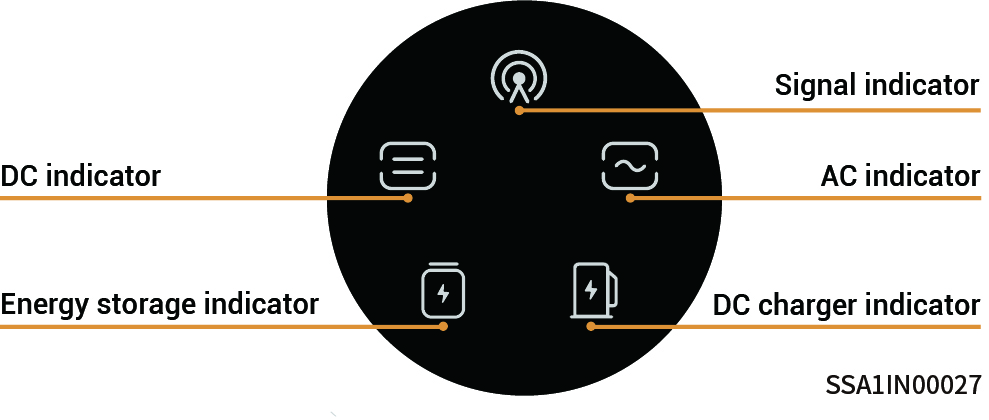
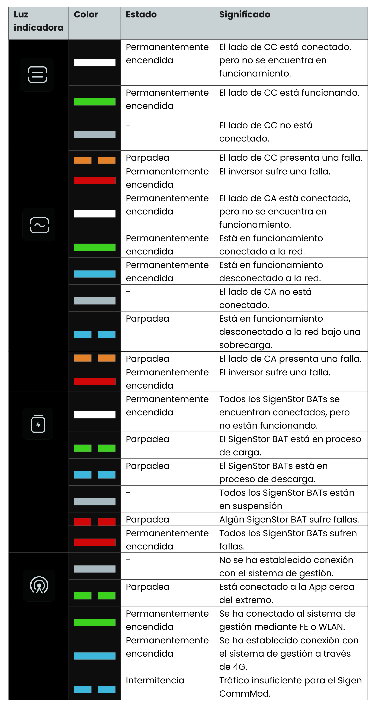

# Estado de los indicadores LED

### **Indicador SigenStor EC/Sigen Hybrid**

<figure><figcaption></figcaption></figure>

<figure><figcaption></figcaption></figure>

<figure><figcaption></figcaption></figure>

### Indicador CommMod

<figure><figcaption></figcaption></figure>

<table><thead><tr><th width="60" align="center">N.º S.</th><th width="192">Denominación</th><th width="300">Estado</th><th>Descripción</th></tr></thead><tbody><tr><td align="center">1</td><td>Indicador de alimentación</td><td>-</td><td>-</td></tr><tr><td align="center">2</td><td>Indicador del estado de red</td><td>Parpadeo lento (200 ms encendido/1800 ms apagado)</td><td>La red se está conectando</td></tr><tr><td align="center">3</td><td>Indicador del estado de red</td><td>Parpadeo lento (1800 ms encendido/200 ms apagado)</td><td>En espera.</td></tr><tr><td align="center">4</td><td>Indicador del estado de red</td><td>Parpadeo rápido (125 ms encendido/125 ms apagado)</td><td>

Se están transfiriendo datos.
</td></tr></tbody></table>
