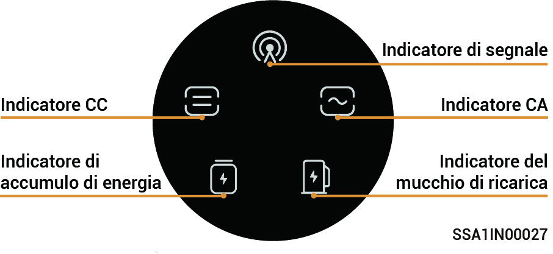
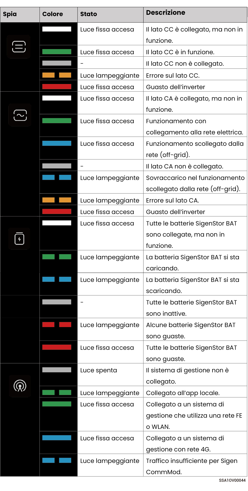

# Stato dell'indicatore LED

### **SigenStor EC/ SigenStor AC/Sigen Hybrid Indicator**

<figure><figcaption></figcaption></figure>

<figure><figcaption></figcaption></figure>

### Indicatore CommMod

<figure><figcaption></figcaption></figure>

<table><thead><tr><th width="80" align="center">N.</th><th width="151">Nome</th><th width="285">Stato</th><th>Descrizione</th></tr></thead><tbody><tr><td align="center">1</td><td>Indicatore di accensione</td><td>-</td><td>-</td></tr><tr><td align="center">2</td><td>Indicatore di stato della rete</td><td><ul><li>Lampeggia lentamente (200 ms acceso/1800 ms spento)</li><li>Lampeggia lentamente (1800 ms acceso/200 ms spento)</li><li>Lampeggia rapidamente (125 ms acceso/125 ms spento)</li></ul></td><td><ul><li>Il collegamento alla rete è in corso</li><li>Standby.</li><li>Il trasferimento dei dati è in corso.</li></ul></td></tr></tbody></table>
