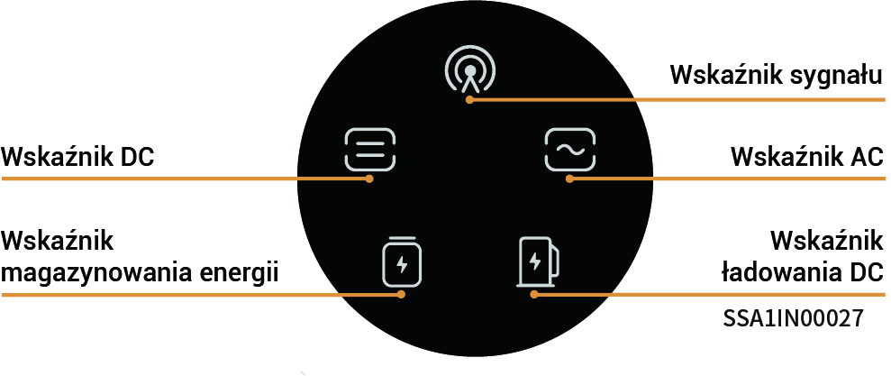
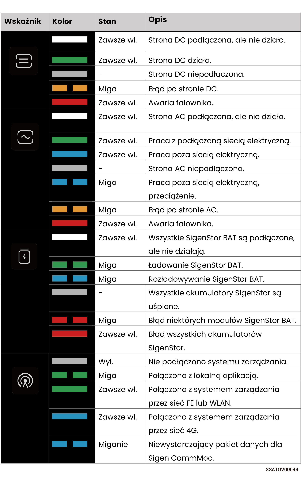

# Stan wskaźnika LED

### **Wskaźnik SigenStor EC/SigenStor AC/Sigen Hybrid**

<figure><figcaption></figcaption></figure>

<figure><figcaption></figcaption></figure>

### Wskaźnik CommMod

<figure><figcaption></figcaption></figure>

<table><thead><tr><th width="80" align="center">S/N</th><th width="151">Nazwa</th><th width="285">Stan</th><th>Opis</th></tr></thead><tbody><tr><td align="center">1</td><td>Wskaźnik zasilania</td><td>-</td><td>-</td></tr><tr><td align="center">2</td><td>Wskaźnik stanu sieci</td><td><ul><li>Miga powoli (200 ms świeci/1800 ms wyłączony)</li><li>Miga powoli (1800 ms świeci/200 ms wyłączony)</li><li>Miga szybko (125 ms świeci/125 ms wyłączony)</li></ul></td><td><ul><li>Łączenie z siecią</li><li>Czuwanie.</li><li>Przesyłanie danych.</li></ul></td></tr></tbody></table>
