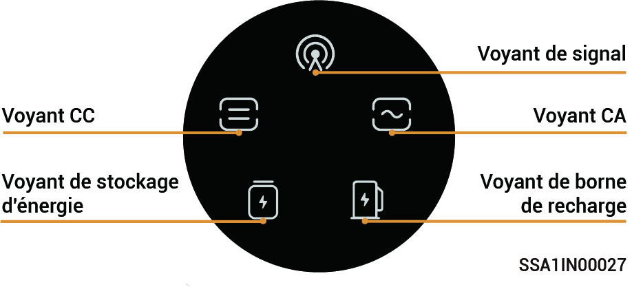
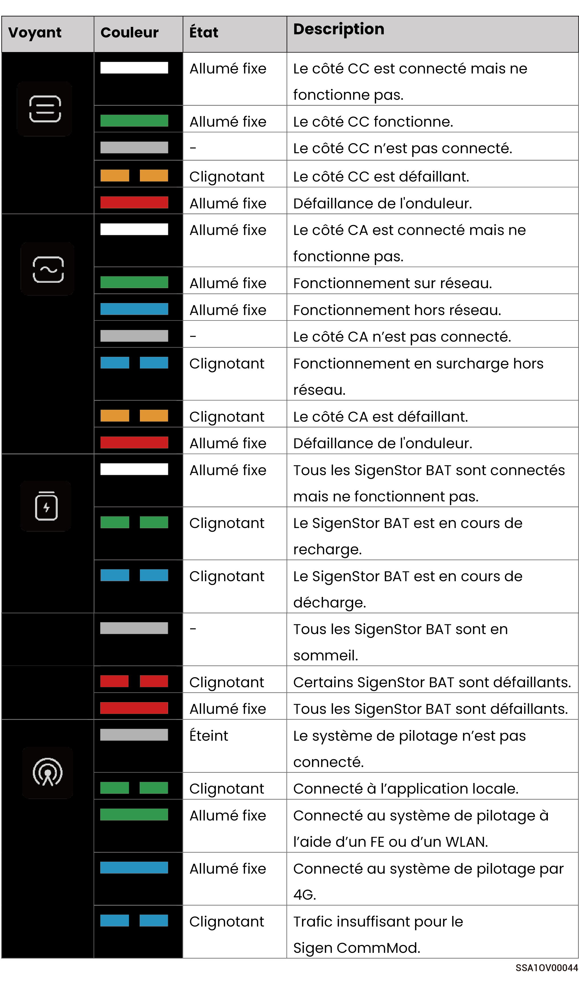

# État des indicateurs lumineux

### **Indicateur SigenStor EC/SigenStor AC/Sigen Hybrid**

<figure><figcaption></figcaption></figure>

<figure><figcaption></figcaption></figure>

<figure><figcaption></figcaption></figure>

### Indicateur CommMod

<figure><figcaption></figcaption></figure>

<table><thead><tr><th width="80" align="center">N°</th><th width="151">Nom</th><th width="285">État</th><th>Description</th></tr></thead><tbody><tr><td align="center">1</td><td>Indicateur d'alimentation</td><td>-</td><td>-</td></tr><tr><td align="center">2</td><td>Indicateur d'état du réseau</td><td><ul><li>Clignotant lentement (200 ms allumé/1 800 ms éteint)</li><li>Clignotant lentement (1 800 ms allumé/200 ms éteint)</li><li>Clignotant rapidement (125 ms allumé/125 ms éteint)</li></ul></td><td><ul><li>Réseau en cours de connexion</li><li>Veille.</li><li>Données en cours de transfert.</li></ul></td></tr></tbody></table>
