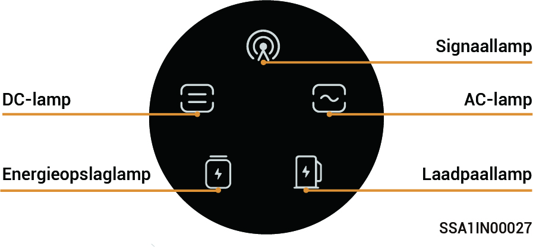
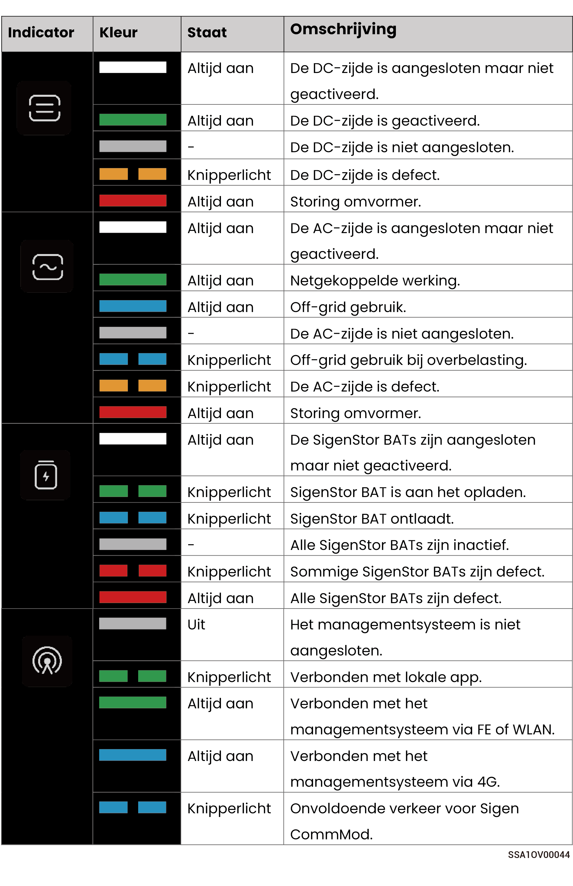

# LED-indicatorstatus

### **SigenStor EC/SigenStor AC/Sigen Hybrid Indicator**

<figure><figcaption></figcaption></figure>

<figure><figcaption></figcaption></figure>

### CommMod Indicator

<figure><figcaption></figcaption></figure>

<table><thead><tr><th width="80" align="center">S/N</th><th width="151">Naam</th><th width="285">Staat</th><th>Beschrijving</th></tr></thead><tbody><tr><td align="center">1</td><td>Stroomindicator</td><td>-</td><td>-</td></tr><tr><td align="center">2</td><td>Netwerkstatusindicator</td><td><ul><li>Langzaam knipperend (200 ms aan/1800 ms uit)</li><li>Langzaam knipperend (1800 ms aan/200 ms uit)</li><li>Snel knipperend (125 ms aan/125 ms uit)</li></ul></td><td><ul><li>Het netwerk wordt verbonden</li><li>Stand-by.</li><li>Er worden gegevens overgedragen.</li></ul></td></tr></tbody></table>
