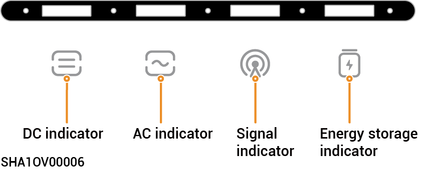
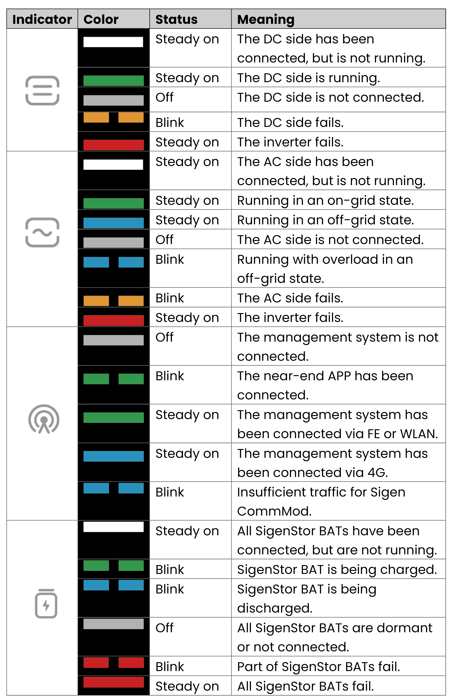
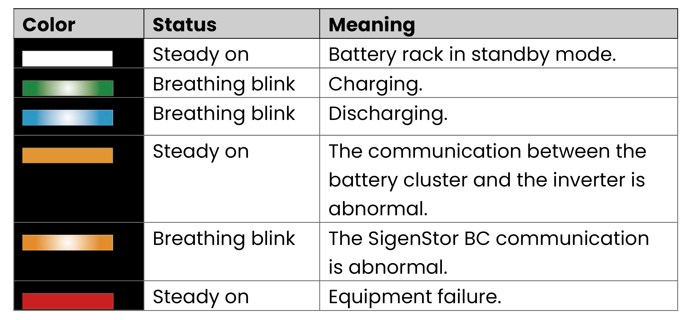

# LED Indicator State

### **Inverter**

<figure><figcaption></figcaption></figure>

<figure><figcaption></figcaption></figure>

## SigenStor Energy Storage System



<mark style="color:blue;">The indicator correctly indicates the real-time power and status of the battery rack.</mark>

<figure><figcaption></figcaption></figure>

<figure><figcaption></figcaption></figure>

### CommMod Indicator

<figure><figcaption></figcaption></figure>

<table><thead><tr><th width="80" align="center">S/N</th><th width="151">Name</th><th width="285">State</th><th>Description</th></tr></thead><tbody><tr><td align="center">1</td><td>Power indicator</td><td>-</td><td>-</td></tr><tr><td align="center">2</td><td>Network state indicator</td><td><ul><li>Slow flashing (200 ms on/1800 ms off)</li><li>Slow flashing (1800 ms on/200 ms off)</li><li>Quick flashing (125 ms on/125 ms off)</li></ul></td><td><ul><li>The network is being connected</li><li>Standby.</li><li>Data is being transferred.</li></ul></td></tr></tbody></table>
