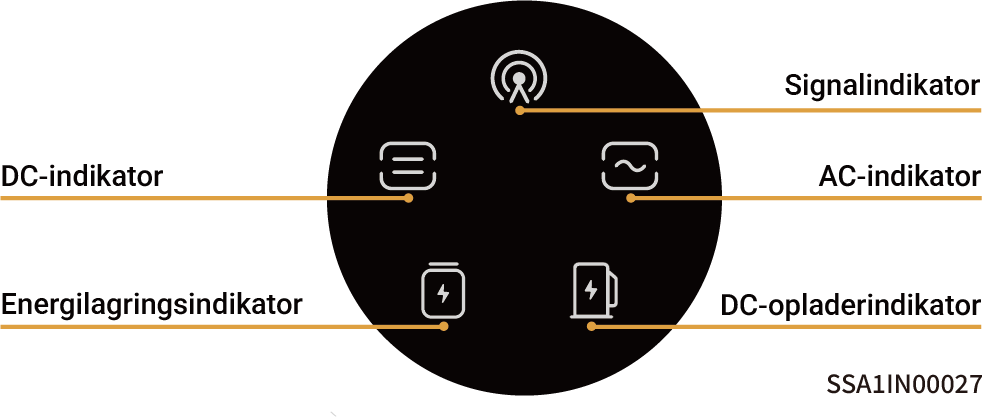
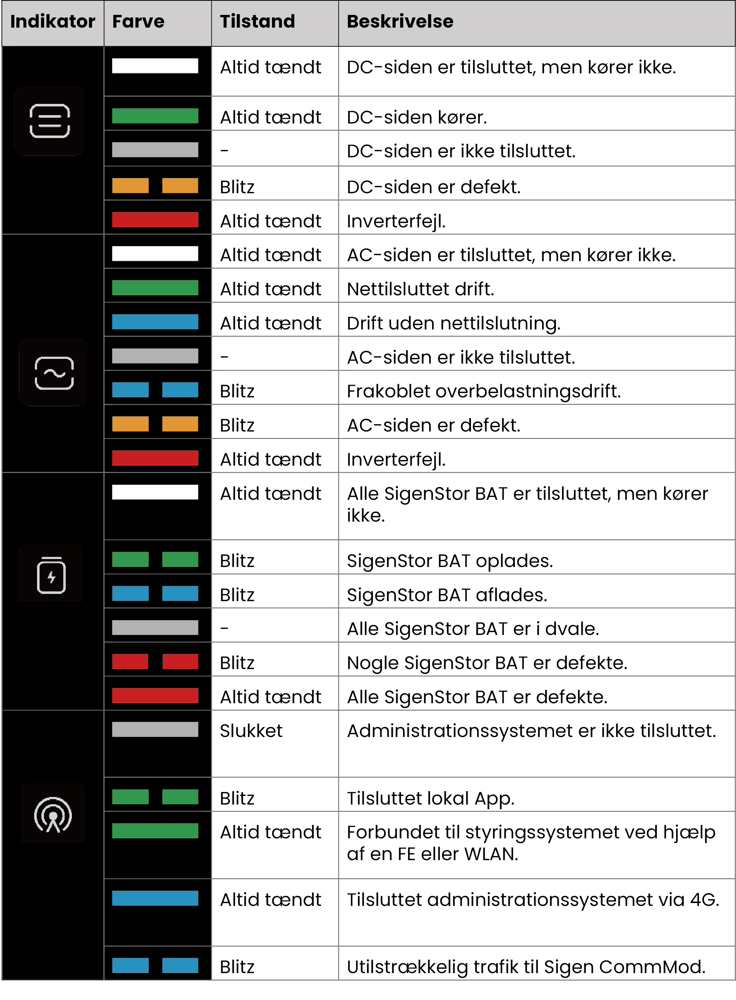

# LED-indikatortilstand

### **SigenStor EC/ Sigen Hybrid-indikator**

<figure><figcaption></figcaption></figure>

<figure><figcaption></figcaption></figure>

### CommMod-indikator

<figure><figcaption></figcaption></figure>

<table><thead><tr><th width="80" align="center">Serienummer</th><th width="151">Navn</th><th width="285">Tilstand</th><th>Beskrivelse</th></tr></thead><tbody><tr><td align="center">1</td><td>Strømindikator</td><td>-</td><td>-</td></tr><tr><td align="center">2</td><td>Netværksstatusindikator</td><td><ul><li>Blinker langsomt (200 ms tændt/1800 ms slukket)</li><li>Blinker langsomt (1800 ms tændt/200 ms slukket)</li><li>Blinker hurtigt (125 ms tændt/125 ms slukket)</li></ul></td><td><ul><li>Netværket forbindes</li><li>Vent.</li><li>Data overføres</li></ul></td></tr></tbody></table>
