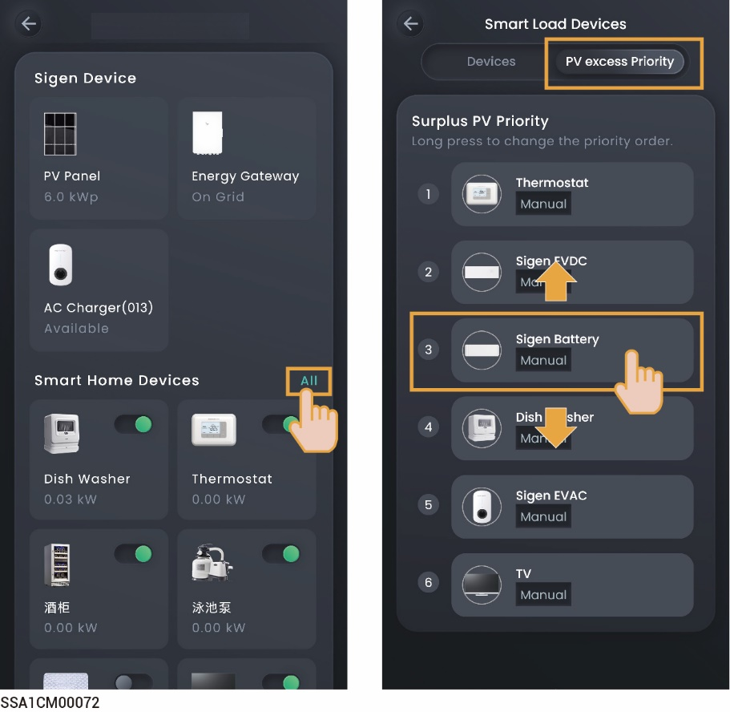
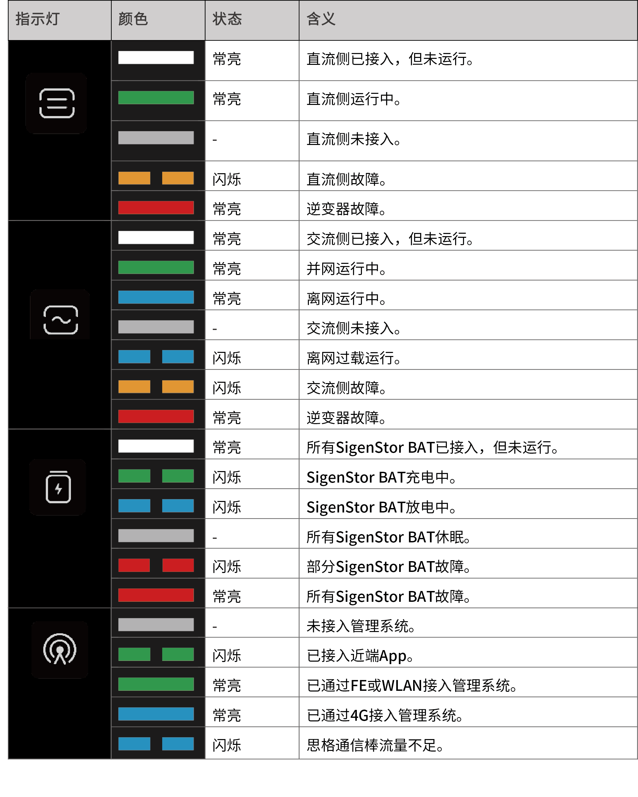

# LED指示灯状态

### **思格能源控制器指示灯**

<figure><figcaption></figcaption></figure>

### **思格通信棒指示灯**

<figure><figcaption></figcaption></figure>

<table><thead><tr><th width="65.88885498046875">序号</th><th width="137">名称</th><th width="275.3333740234375">状态</th><th>说明</th></tr></thead><tbody><tr><td>1</td><td>电源灯</td><td>-</td><td>-</td></tr><tr><td>2</td><td>网络状态灯</td><td>

<ul><li>慢闪（200ms亮/1800ms灭）</li></ul><ul><li>慢闪（1800ms亮/200ms灭）</li></ul><ul><li>快闪（125ms亮/125ms灭）</li></ul></td><td>

<ul><li>正在连接网络。 </li></ul><ul><li>待机中。 </li></ul><ul><li>数据传输中。</li></ul></td></tr></tbody></table>
