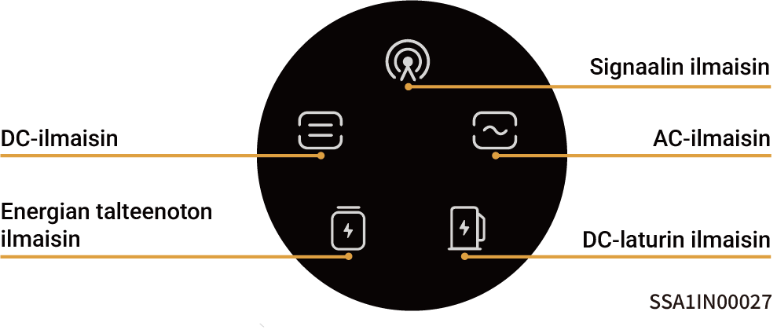
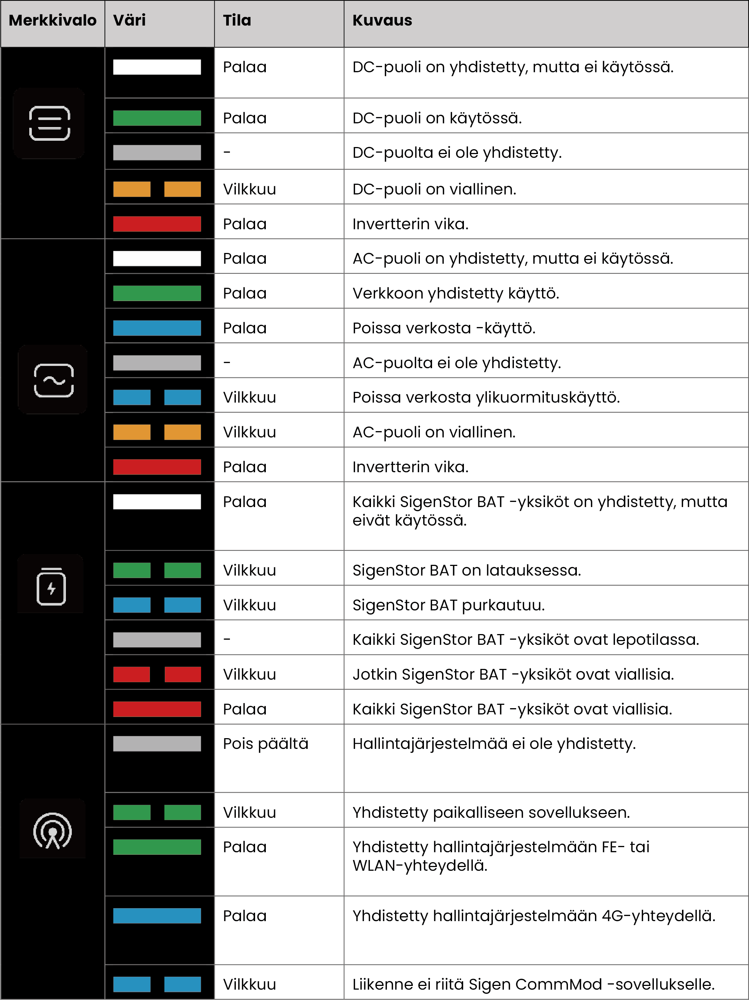

# LED-ilmaisimen tila

### **SigenStor EC / Sigen Hybrid -ilmaisin**

<figure><figcaption></figcaption></figure>

<figure><figcaption></figcaption></figure>

### CommMod-ilmaisin

<figure><figcaption></figcaption></figure>

<table><thead><tr><th width="80" align="center">S/N</th><th width="151">Nimi</th><th width="285">Tila</th><th>Kuvaus</th></tr></thead><tbody><tr><td align="center">1</td><td>Virran merkkivalo</td><td>-</td><td>-</td></tr><tr><td align="center">2</td><td>Verkon tilan merkkivalo</td><td><ul><li>Hidas vilkkuminen (200 ms päällä / 1800 ms pois päältä)</li><li>Hidas vilkkuminen (1800 ms päällä / 200 ms pois päältä)</li><li>Nopea vilkkuminen(125 ms päällä / 125 ms pois päältä)</li></ul></td><td><ul><li>Verkkoa yhdistetään</li><li>Valmiustila.</li><li>Tietoja siirretään.</li></ul></td></tr></tbody></table>
