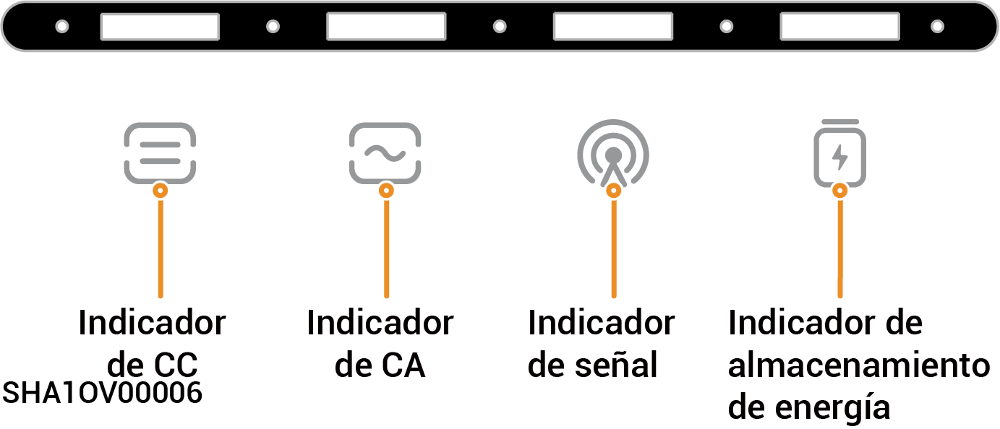
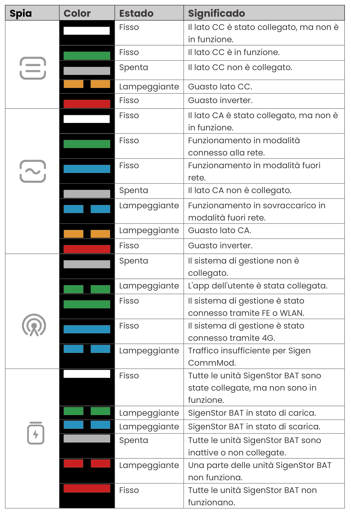
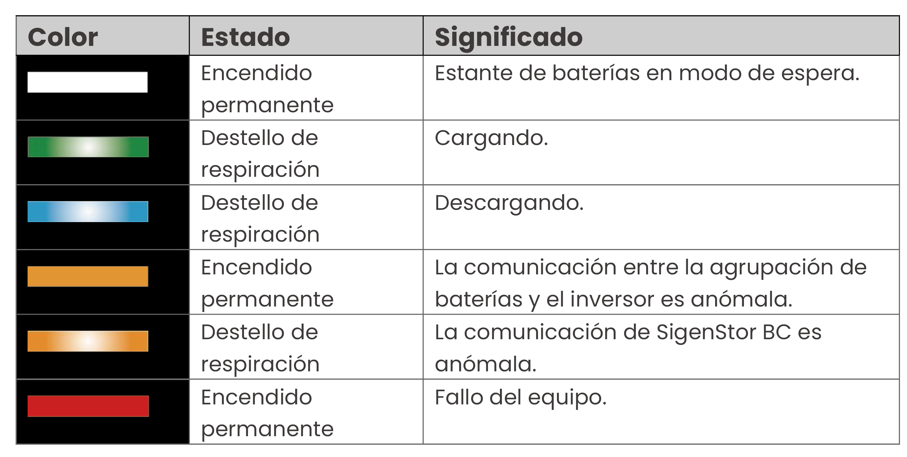

# Estado de los indicadores LED

### **Inversor**

<figure><figcaption></figcaption></figure>

<figure><figcaption></figcaption></figure>

## Sistema de almacenamiento de energía



<mark style="color:blue;">El indicador indica correctamente en tiempo real la energía y el estado del estante de baterías.</mark>

<figure><figcaption></figcaption></figure>

<figure><figcaption></figcaption></figure>

### Indicador CommMod

<figure><figcaption></figcaption></figure>

<table><thead><tr><th width="80" align="center">N.º S.</th><th width="151">Denominación</th><th width="285">Estado</th><th>Descripción</th></tr></thead><tbody><tr><td align="center">1</td><td>Indicador de alimentación</td><td>-</td><td>-</td></tr><tr><td align="center">2</td><td>Indicador del estado de red</td><td><ul><li>Parpadeo lento (200 ms encendido/1800 ms apagado)</li><li>Parpadeo lento (1800 ms encendido/200 ms apagado)</li><li>Parpadeo rápido (125 ms encendido/125 ms apagado)</li></ul></td><td><ul><li>La red se está conectando</li><li>En espera.</li><li>Se están transfiriendo datos.</li></ul></td></tr></tbody></table>
