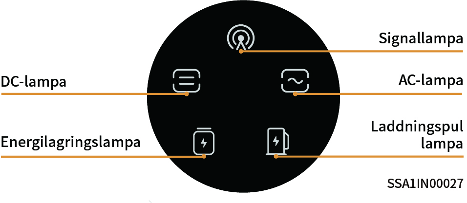
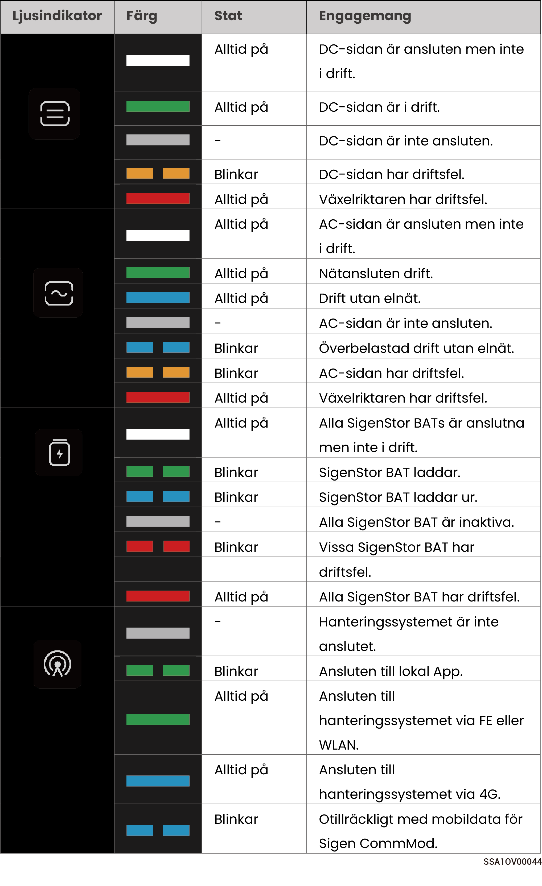
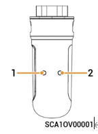

# LED-indikatorstatus

### **Indikering på SigenStor EC/SigenStor AC/Sigen Hybrid**

<figure><figcaption></figcaption></figure>

<figure><figcaption></figcaption></figure>

### CommMod-indikering

<figure><figcaption></figcaption></figure>

<table><thead><tr><th width="80" align="center">Siffra</th><th width="151">Namn</th><th width="285">Status</th><th>Beskrivning</th></tr></thead><tbody><tr><td align="center">1</td><td>Strömindikering</td><td>-</td><td>-</td></tr><tr><td align="center">2</td><td>Indikering av nätverksstatus</td><td><ul><li>Blinkar långsamt (200 ms på/1 800 ms av)</li><li>Blinkar långsamt (1 800 ms på/200 ms av)</li><li>Blinkar snabbt (125 ms på/125 ms av)</li></ul></td><td><ul><li>Nätverksanslutning upprättas</li><li>Vänteläge.</li><li>Data överförs.</li></ul></td></tr></tbody></table>
