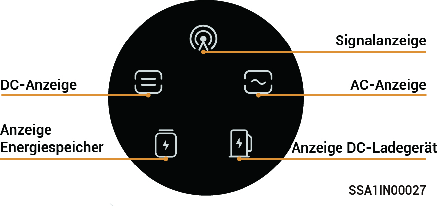
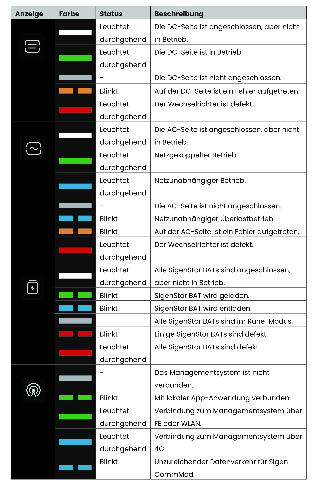

# LED-Anzeige-Status

### **SigenStor EC/Sigen Hybrid-Anzeige**

<figure><figcaption></figcaption></figure>

<figure><figcaption></figcaption></figure>

### &#x20;CommMod-Anzeige

<figure><figcaption></figcaption></figure>

<table><thead><tr><th width="80" align="center" valign="middle">Seriennr.</th><th width="151">Bezeichnung</th><th width="285">Status</th><th>Beschreibung</th></tr></thead><tbody><tr><td align="center" valign="middle">1</td><td>Betriebsanzeige</td><td>-</td><td>-</td></tr><tr><td align="center" valign="middle">2</td><td>Netzwerkstatusanzeige</td><td><ul><li>Blinkt langsam (200 ms an/1800 ms aus)</li></ul></td><td><ul><li>Mit Netzwerk wird verbunden.</li></ul></td></tr><tr><td align="center" valign="middle">3</td><td>Netzwerkstatusanzeige</td><td>

<ul><li>Blinkt langsam (1800 ms an/200 ms aus)</li></ul></td><td>

<ul><li>Bereitschaftszustand.</li></ul></td></tr><tr><td align="center" valign="middle">4</td><td>Netzwerkstatusanzeige</td><td>

<ul><li>Blinkt schnell (125 ms an/125 ms aus)</li></ul></td><td>

<ul><li>Daten werden übertragen.</li></ul></td></tr></tbody></table>

