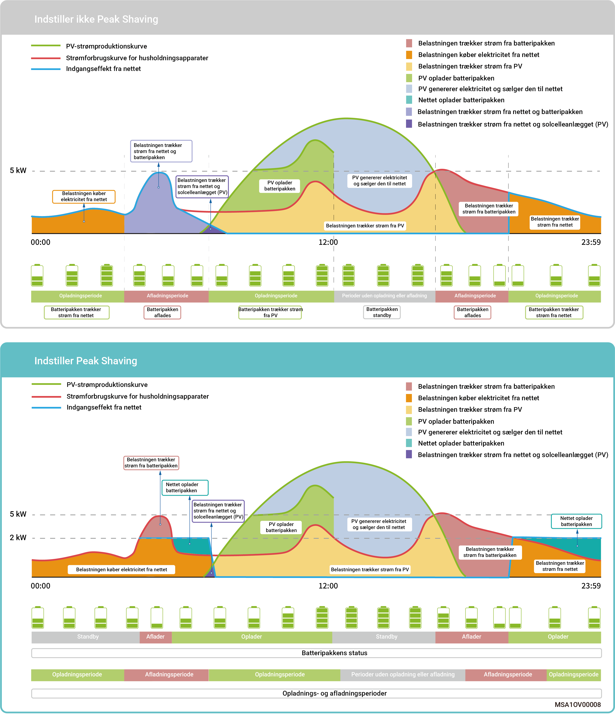

# Spidsbelastningsudjævning

* I nogle regioner beregnes elregningen som følger: Samlet elregning = Omkostninger ved spidsbelastning + omkostninger til elforbrug + andre omkostninger. Hvorved spidsbelastning refererer til den maksimale effekt, der importeres fra elnettet. Denne tilstand er velegnet til områder med spidsbelastnings- og dalpriser på elektricitet og betydelige prisforskelle.
* Spidsbelastningsudjævning-funktionen kan bruges i alle arbejdsmodi og konfigurerer den maksimale spidseffekt, der trækkes fra elnettet, for at reducere den maksimale spidseffekt, der trækkes fra elnettet i spidsbelastningsperioder, og dermed sænke elregningen.

### **Eksempel 1: Indstillinger for egenforbrug til spidsbelastningsudjævning**

Antag, at SOC for spidsbelastningsudjævning er indstillet til 50 %, og den maksimale spidsbelastning er 2 kW. Fordi den samlede elregning = omkostninger ved spidsbelastning + omkostninger til elforbrug + andre omkostninger. Hvorved spidsbelastning refererer til den maksimale effekt, der importeres fra elnettet. Når selvforbrugstilstanden er indstillet til spidsbelastningsudjævning, falder den strøm, der købes fra elnettet, fra 5 kW til 2 kW, så den samlede elregning reduceres.

<figure><figcaption></figcaption></figure>

### **Eksempel 2: Indstillinger for tidsbaseret kontrol til spidsbelastningsudjævning**

Antag, at SOC for spidsbelastningsudjævning er indstillet til 50 %, og den maksimale spidsbelastning er 2 kW. Fordi den samlede elregning = omkostninger ved spidsbelastning + omkostninger til elforbrug + andre omkostninger. Hvorved spidsbelastning refererer til den maksimale effekt, der importeres fra elnettet. Når tidsbaseret kontrolmodus er indstillet til spidsbelastningsudjævning, falder den strøm, der købes fra elnettet, fra 5 kW til 2 kW, så den samlede elregning reduceres.

<figure><figcaption></figcaption></figure>
