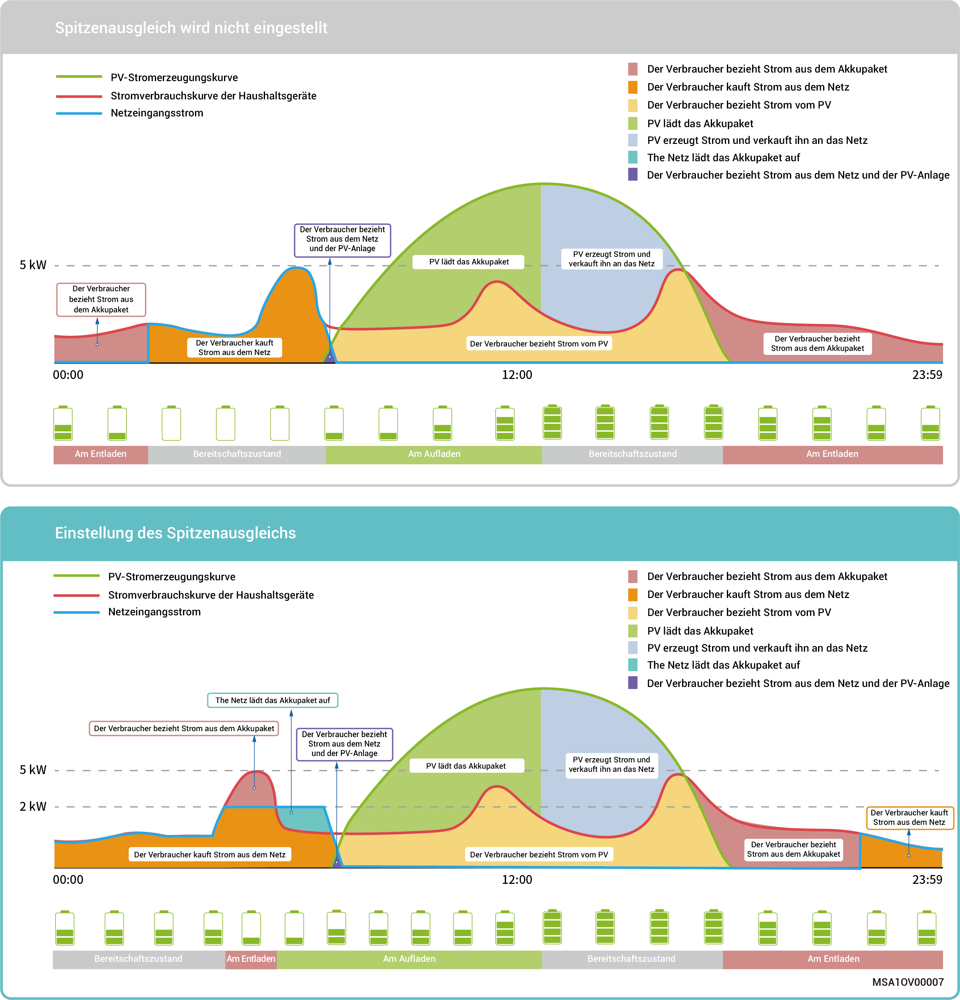
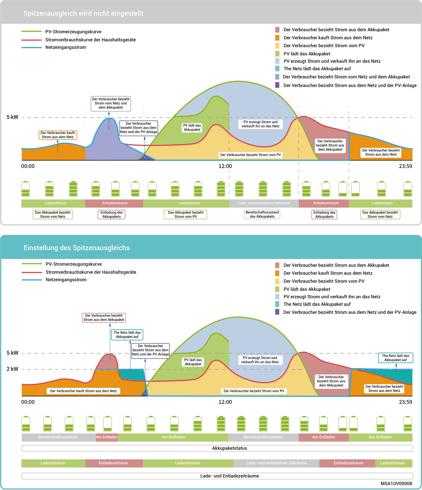

# „Peak Shaving“-Steuerungsmodus

* Die Stromrechnung wird in einigen Regionen wie folgt berechnet: Gesamte Stromrechnung = Kosten bei Spitzenleistung + Kosten für Stromverbrauch + sonstige Kosten. Dabei bezieht sich Spitzenleistung auf die maximale Leistung, die aus dem Netz bezogen wird. Dieser Modus eignet sich für Gebiete mit sogenannten Höchst- und Tiefststrompreisen und erheblichen Preisunterschieden.
* Die Funktion Lastspitzenkappung kann mit allen Arbeitsmodi verwendet werden, indem die maximale Spitzenleistung, die aus dem Netz bezogen wird, konfiguriert wird, um die maximale Spitzenleistung, die aus dem Netz bezogen wird, während der Spitzenzeiten zu reduzieren und so die Stromrechnung zu senken.

### **Beispiel 1: Einstellungen des Eigenverbrauchsmodus für die Lastspitzenkappung**

Angenommen, der Spitzenlast-SOC ist auf 50 % eingestellt und die maximale Spitzenleistung beträgt 2 kW. Denn die Gesamtrechnung für Strom = Kosten bei Spitzenlast + Kosten für Stromverbrauch + sonstige Kosten. Dabei bezieht sich Spitzenleistung auf die maximale Leistung, die aus dem Netz bezogen wird. Nachdem der Eigenverbrauchsmodus auf Lastspitzenkappung eingestellt wurde, sinkt die aus dem Netz bezogene Leistung von 5 kW auf 2 kW, sodass die Stromrechnung insgesamt sinkt.

<figure><figcaption></figcaption></figure>

### **Beispiel 2: Einstellungen des zeitbasierten Steuermodus für Lastspitzenkappung**

Angenommen, der Spitzenlast-SOC ist auf 50 % eingestellt und die maximale Spitzenleistung beträgt 2 kW. Denn die Gesamtrechnung für Strom = Kosten bei Spitzenlast + Kosten für Stromverbrauch + sonstige Kosten. Dabei bezieht sich Spitzenleistung auf die maximale Leistung, die aus dem Netz bezogen wird. Nachdem der zeitbasierte Steuerungsmodus auf Lastspitzenkappung eingestellt wurde, sinkt die vom Netz bezogene Leistung von 5 kW auf 2 kW, sodass die Stromrechnung sich insgesamt reduziert.

<figure><figcaption></figcaption></figure>
