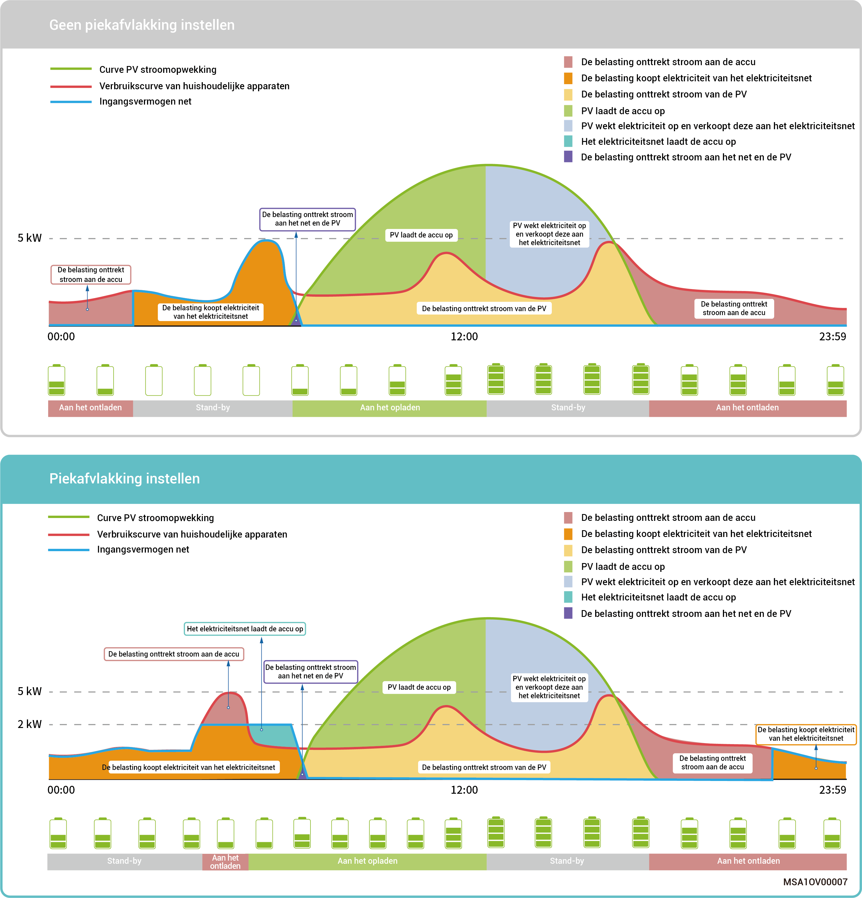
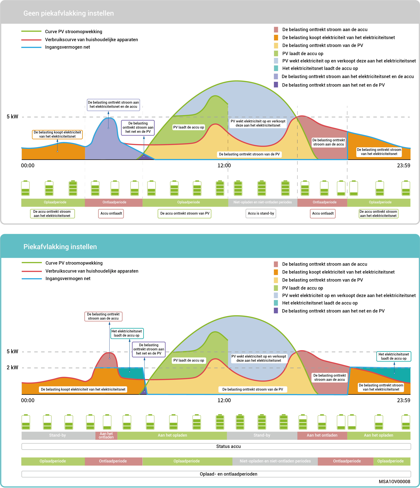

# Besturingsmodus piekafvlakking

* De elektriciteitsrekening wordt in sommige regio's als volgt berekend: Totale elektriciteitsrekening = kosten bij piekvermogen + kosten voor elektriciteitsgebruik + andere kosten. Waarbij piekvermogen verwijst naar het maximale vermogen dat van het elektriciteitsnet wordt geïmporteerd. Deze modus is geschikt voor gebieden met piek- en dalprijzen voor elektriciteit en aanzienlijke prijsverschillen.
* De functie piekafvlakking kan in alle werkmodi worden gebruikt, waarbij het maximale piekvermogen dat uit het net wordt getrokken wordt geconfigureerd om het maximale piekvermogen tijdens piekperiodes te verlagen, waardoor de elektriciteitsrekening wordt verlaagd.

### **Voorbeeld 1: Instellingen voor Eigen verbruiksmodus voor piekafvlakking**

Stel dat de piekafvlakking SOC is ingesteld op 50% en het maximale piekvermogen 2 kW is. Omdat de totale elektriciteitsrekening = kosten bij piekvermogen + kosten voor elektriciteitsverbruik + andere kosten. Waarbij piekvermogen verwijst naar het maximale vermogen dat van het elektriciteitsnet wordt geïmporteerd. Nadat de Eigen verbruiksmodus is ingesteld op piekafvlakking, daalt het vermogen dat uit het net wordt gekocht van 5 kW naar 2 kW, waardoor de totale elektriciteitsrekening wordt verlaagd.

<figure><figcaption></figcaption></figure>

### Voorbeeld 2: Instellingen voor Tijdgestuurde controle-modus voor piekafvlakking

Stel dat de piekafvlakking SOC is ingesteld op 50% en het maximale piekvermogen 2 kW is. Omdat de totale elektriciteitsrekening = kosten bij piekvermogen + kosten voor elektriciteitsverbruik + andere kosten. Waarbij piekvermogen verwijst naar het maximale vermogen dat van het elektriciteitsnet wordt geïmporteerd. Nadat de Tijdgestuurde controle-modus is ingesteld op piekafvlakking, daalt het vermogen dat uit het net wordt gekocht van 5 kW naar 2 kW, waardoor de totale elektriciteitsrekening wordt verlaagd.

<figure><figcaption></figcaption></figure>
