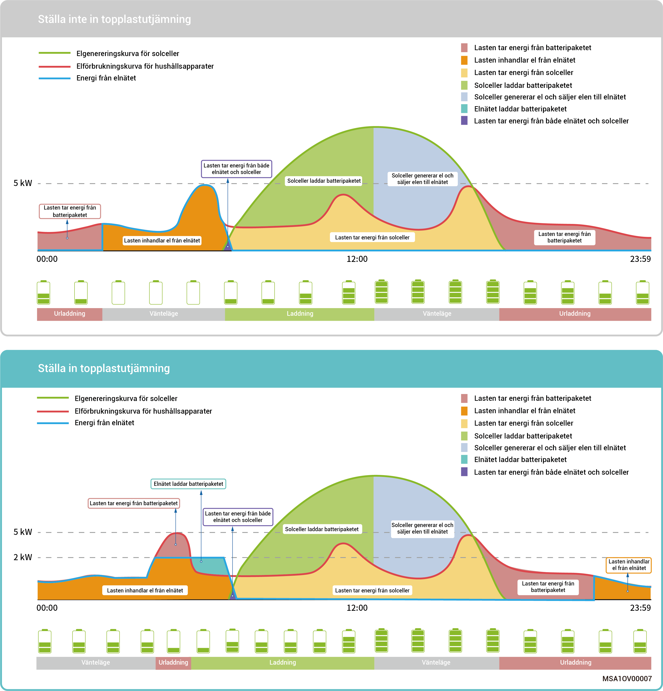
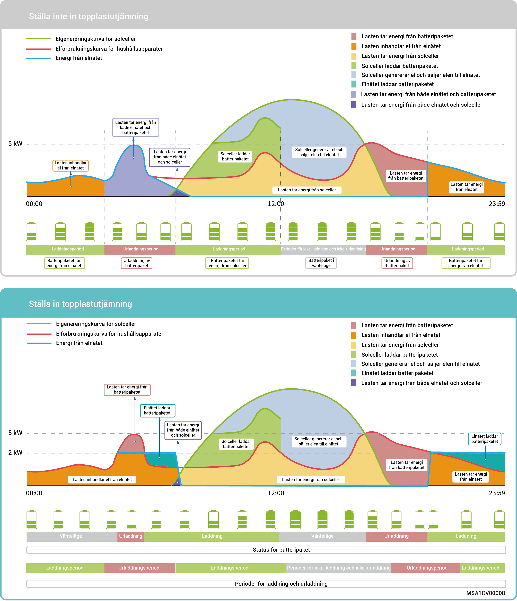

# Läge för styrning av topplastutjämning

* I vissa regioner beräknas elräkningen enligt följande: Total elräkning = kostnad vid toppeffekt + kostnad för elförbrukning + övriga kostnader. Där toppeffekt betyder maximal effekt som importeras från elnätet. Detta läge lämpar sig för områden med höga och låga elpriser samt betydande prisskillnader.
* Funktionen för topplastutjämning kan användas med alla arbetslägen. Den konfigurerar maximal toppeffekt som dras från elnätet för att minska den maximala toppeffekt som dras från elnätet under topperioder, vilket sänker elräkningen.

### **Exempel 1: Inställningar för självförsörjningsläge med topplastutjämning**

Anta att topputjämningens SoC är inställd på 50 procent och maximal toppeffekt är 2 kW. Då den totala elräkningen = kostnad vid toppeffekt + kostnad för elförbrukning + övriga kostnader. Där toppeffekt betyder maximal effekt som importeras från elnätet. När självförsörjningsläget ställs in på topplastutjämning sjunker inköpt effekt från elnätet från 5 kW till 2 kW, och den totala elräkningen minskar.

<figure><figcaption></figcaption></figure>

### Exempel 2: Inställningar för tidsstyrningsläge med topplastutjämning

Anta att topputjämningens SoC är inställd på 50 procent och maximal toppeffekt är 2 kW. Då den totala elräkningen = kostnad vid toppeffekt + kostnad för elförbrukning + övriga kostnader. Där toppeffekt betyder maximal effekt som importeras från elnätet. När tidsstyrningsläget ställs in på topplastutjämning sjunker inköpt effekt från elnätet från 5 kW till 2 kW, och den totala elräkningen minskar.

<figure><figcaption></figcaption></figure>
