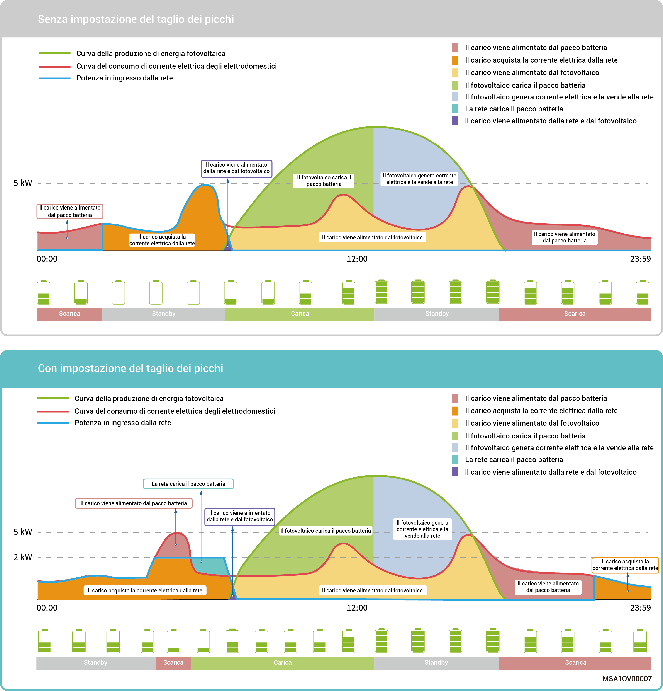
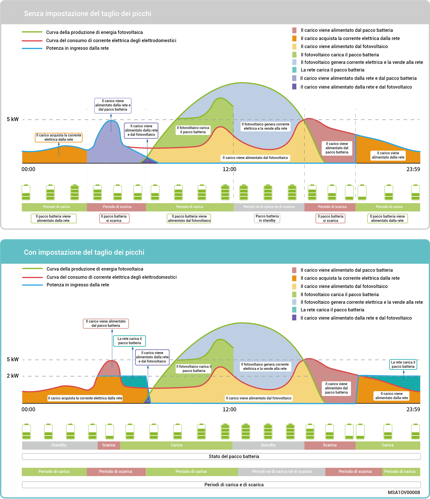

# Modalità di controllo limatura del picco

* In alcune regioni, la bolletta elettrica viene calcolata nel modo seguente: Bolletta elettrica totale = Costo alla potenza di picco + costo per l'utilizzo dell'energia elettrica + altri costi. Dove la potenza di picco si riferisce alla massima potenza importata dalla rete. Questa modalità è adatta per le zone con differenze significative tra i prezzi dell'energia elettrica durante i periodi di alta e bassa domanda.
* La funzione di taglio dei picchi può essere utilizzata con tutte le modalità di funzionamento, configurando la potenza di picco massima prelevata dalla rete in modo da ridurre il prelievo durante i periodi di picco, riducendo così la bolletta elettrica.

### **Esempio 1: Impostazioni nella modalità autoconsumo per il taglio dei picchi**

Si supponga che lo stato di carica per il taglio dei picchi sia impostato al 50% e che la potenza di picco massima sia pari a 2 kW. La formula è: Bolletta elettrica totale = Costo alla potenza di picco + costo per l'utilizzo dell'energia elettrica + altri costi. Dove la potenza di picco si riferisce alla massima potenza importata dalla rete. Dopo avere impostato il taglio dei picchi nella modalità autoconsumo, la potenza acquistata dalla rete scende da 5 kW a 2 kW, riducendo così la bolletta elettrica totale.

<figure><figcaption></figcaption></figure>

### Esempio 2: Impostazioni nella modalità di controllo basata sul tempo per il taglio dei picchi

Si supponga che lo stato di carica per il taglio dei picchi sia impostato al 50% e che la potenza di picco massima sia pari a 2 kW. La formula è: Bolletta elettrica totale = Costo alla potenza di picco + costo per l'utilizzo dell'energia elettrica + altri costi. Dove la potenza di picco si riferisce alla massima potenza importata dalla rete. Dopo avere impostato il taglio dei picchi nella modalità di controllo basata sul tempo, la potenza acquistata dalla rete scende da 5 kW a 2 kW, riducendo così la bolletta elettrica totale.

<figure><figcaption></figcaption></figure>
