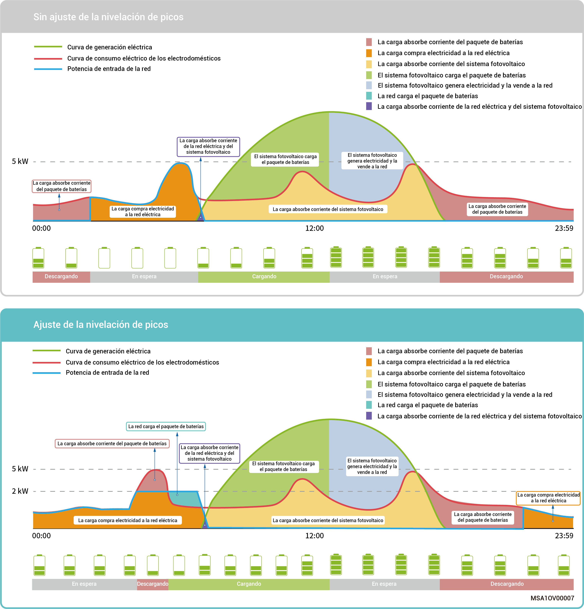
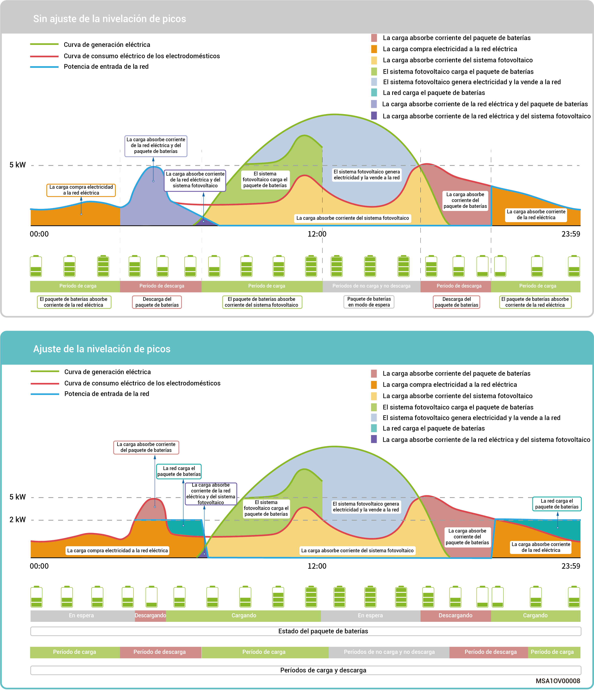

# Modo de control de recorte de pico

* En algunas regiones la factura eléctrica se calcula tal como sigue: Factura eléctrica total = Coste de la corriente de pico + coste por el consumo eléctrico + otros costes. Donde la corriente de pico se refiere a la corriente máxima importada de la red. Este modo es adecuado para zonas con precios pico y valle de la electricidad con diferencias de precio significativas.
* La función Recorte de pico puede usarse con todos los modos de trabajo, configurando la corriente de pico máxima absorbida de la red para reducir la absorbida durante los períodos de pico y así reducir la factura eléctrica.

**Ejemplo 1: Ajustes de modo de autoconsumo para Recorte de pico**

Suponga que el SOC de recorte de pico se fija al 50 % y que la potencia de pico máxima es de 2 kW. Dado que Factura eléctrica total = Coste de la corriente de pico + coste por el uso de la electricidad + otros costes. Donde la corriente de pico se refiere a la corriente máxima importada de la red. Después de fijar el modo de autoconsumo para Recorte de pico, la corriente adquirida a la red cae de 5 a 2 kW, por lo que se reduce la factura eléctrica total.

<figure><figcaption></figcaption></figure>

### Ejemplo 2: Ajustes de modo de control basado en el tiempo para Recorte de pico

Suponga que el SOC de recorte de pico se fija al 50 % y que la potencia de pico máxima es de 2 kW. Dado que Factura eléctrica total = Coste de la corriente de pico + coste por el uso de la electricidad + otros costes. Donde la corriente de pico se refiere a la corriente máxima importada de la red. Después de fijar el modo de control basado en el tiempo para Recorte de pico, la corriente adquirida a la red cae de 5 a 2 kW, por lo que se reduce la factura eléctrica total.

<figure><figcaption></figcaption></figure>
