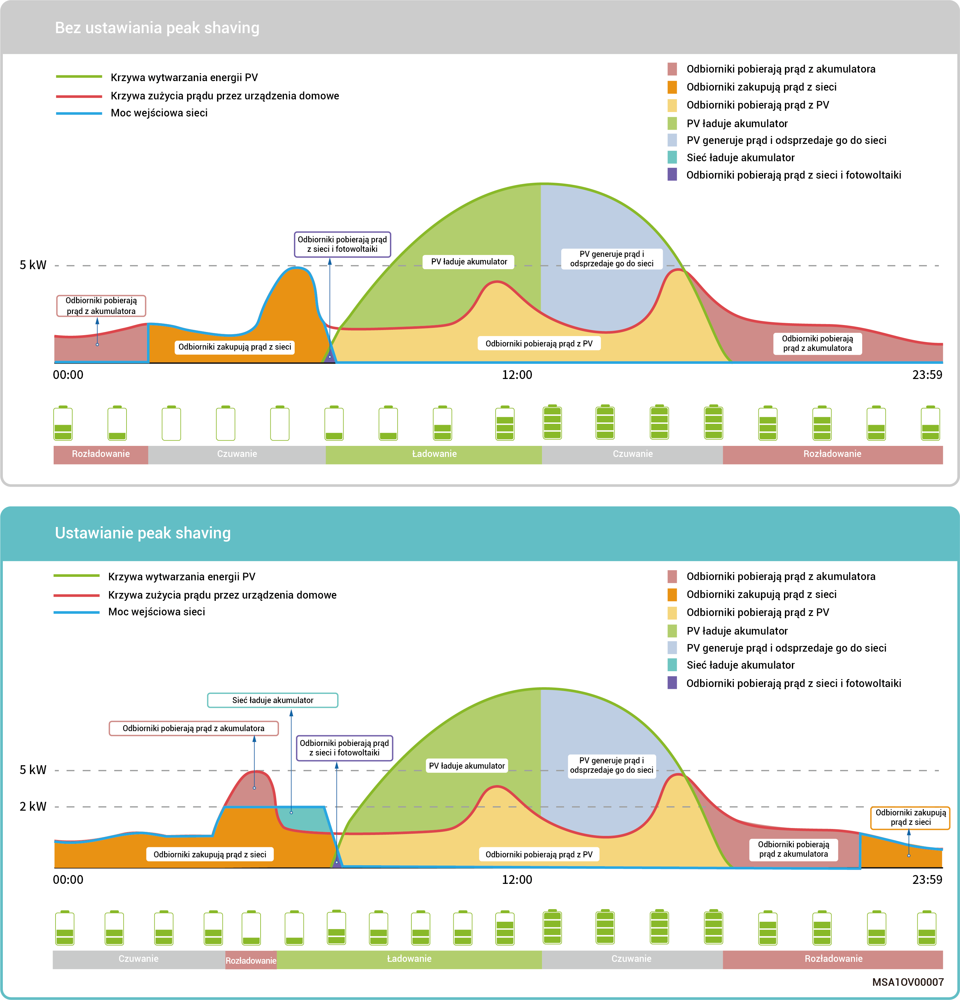
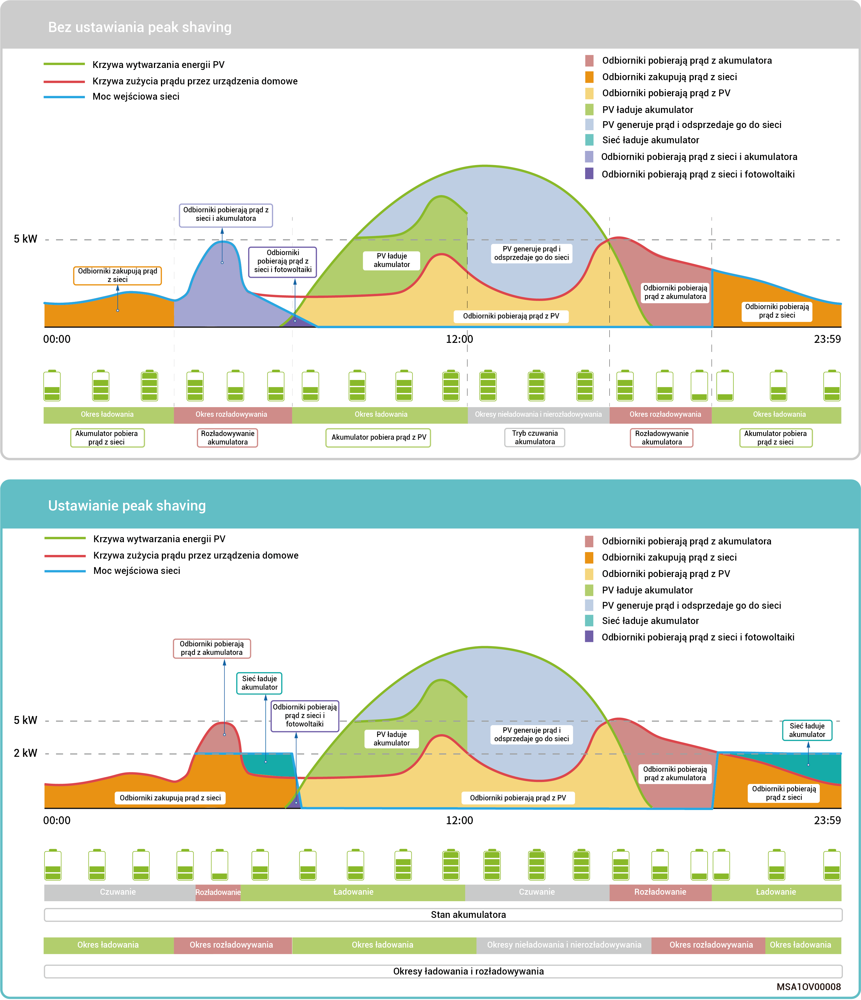

# Tryb kontroli peak shaving

* Rachunek za prąd w niektórych regionach oblicza się następująco: Całkowity rachunek za prąd = koszt szczytowej mocy + koszt zużycia energii elektrycznej + inne koszty. Gdzie szczytowa moc odnosi się do maksymalnej mocy pobieranej z sieci. Ten tryb sprawdzi się w obszarach w których obowiązują inne taryfy w szczycie i okresie niskiego zapotrzebowania na energię, a różnice w cenach są znaczne.
* Funkcja peak shaving może być używana we wszystkich trybach pracy poprzez konfigurację maksymalnej szczytowej mocy pobieranej z sieci w celu zmniejszenia maksymalnej szczytowej mocy pobieranej z sieci w okresach szczytowych, co prowadzi do obniżenia rachunku za prąd.

### **Przykład 1: Ustawienia trybu auto-konsumpcji do peak shaving**

Przyjmijmy, że dla peak shaving ustawiono SOC o wartości 50% a maksymalną moc szczytową jako is 2kW. Ponieważ całkowity rachunek za prąd = koszt szczytowej mocy + koszt zużycia energii elektrycznej + inne koszty. Gdzie szczytowa moc odnosi się do maksymalnej mocy pobieranej z sieci. Po włączeniu peak shaving dla trybu auto-konsumpcji energia zakupiona z sieci spada z 5 kW do 2 kW, co powoduje obniżenie rachunku za prąd.

<figure><figcaption></figcaption></figure>

### Przykład 2: Ustawienia czasowego trybu kontroli do peak shaving

Przyjmijmy, że dla peak shaving ustawiono SOC o wartości 50% a maksymalną moc szczytową jako is 2kW. Ponieważ całkowity rachunek za prąd = koszt szczytowej mocy + koszt zużycia energii elektrycznej + inne koszty. Gdzie szczytowa moc odnosi się do maksymalnej mocy pobieranej z sieci. Po włączeniu peak shaving dla czasowego trybu kontroli energia zakupiona z sieci spada z 5 kW do 2 kW, co powoduje obniżenie rachunku za prąd.

<figure><figcaption></figcaption></figure>
