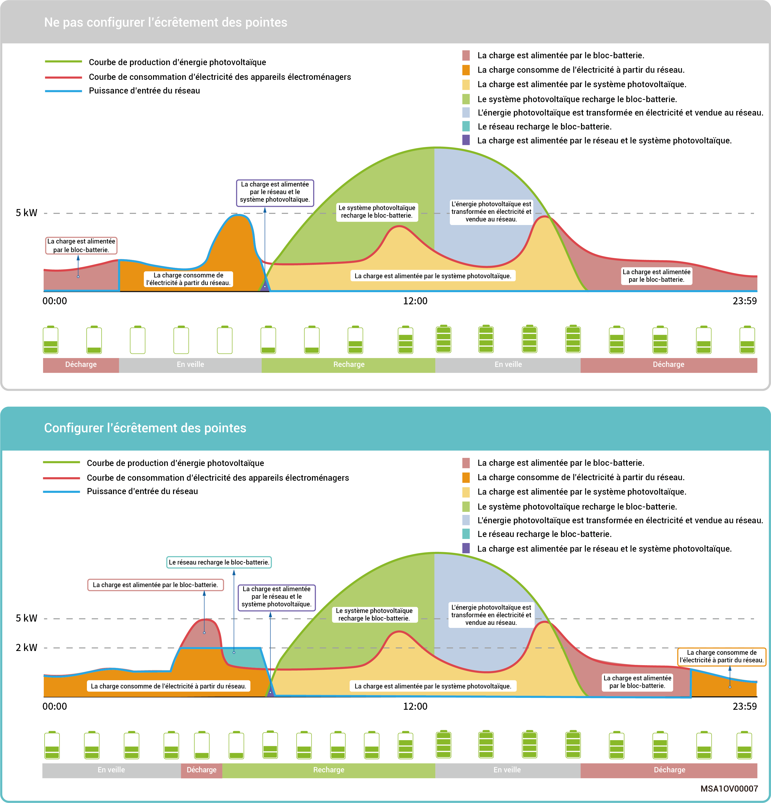
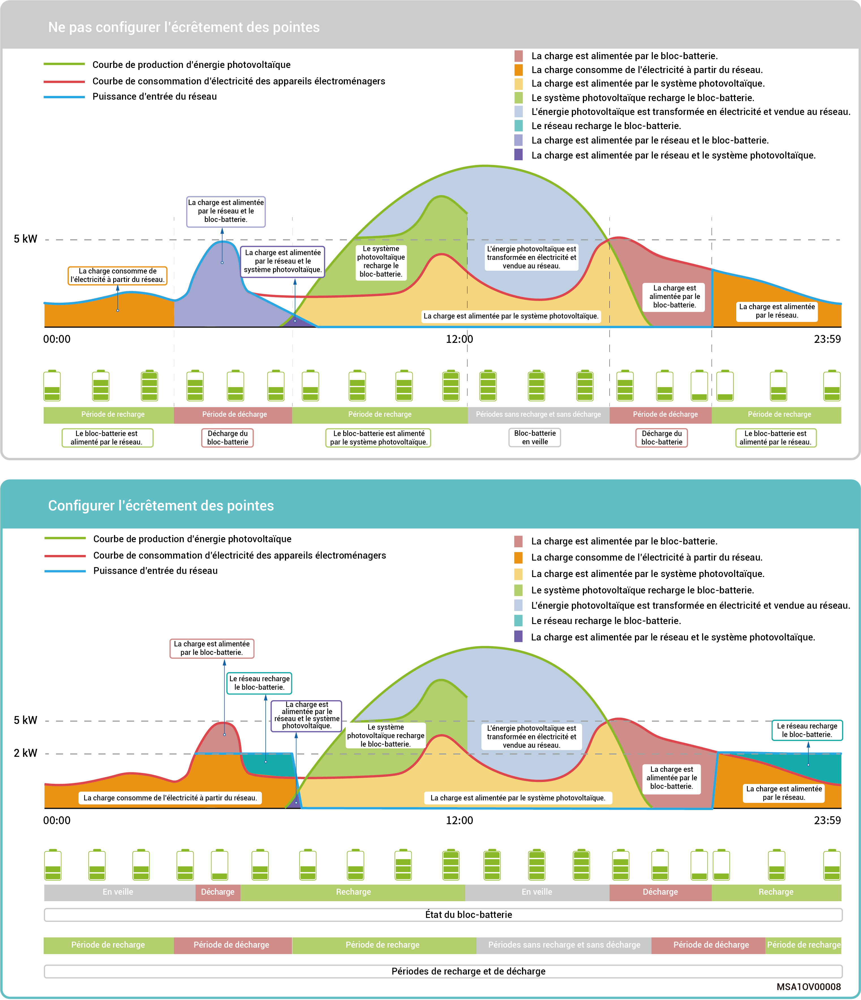

# Mode de contrôle de la fonction d'écrêtement des pointes

* Dans certaines régions, la facture d'électricité est calculée comme suit : Facture totale d'électricité = coût de la puissance de pointe + coût d'utilisation de l'électricité + autres coûts. Dans ce cas, la puissance de crête correspond à la puissance maximale importée du réseau. Ce mode est adapté aux zones où les prix de l'électricité sont définis selon les heures creuses et les heures de pointe et où les écarts de prix sont importants.
* La fonction d'écrêtement des pointes est applicable à tous les modes de fonctionnement. Elle permet de configurer la puissance maximale de pointe prélevée du réseau afin de réduire la puissance maximale de pointe prélevée du réseau pendant les heures de pointe, ce qui permet de réduire la facture d'électricité.

### **Exemple 1 : paramètres du mode autoconsommation pour l'écrêtement des pointes**

Supposons que le niveau de charge (SOC) d'écrêtement des pointes soit réglé sur 50 % et que la puissance de pointe maximale soit de 2 kW. Étant donné que : facture totale d'électricité = coût de la puissance de pointe + coût d'utilisation de l'électricité + autres coûts. Dans ce cas, la puissance de crête correspond à la puissance maximale importée du réseau. Après avoir réglé le mode autoconsommation sur Écrêtement des pointes, la puissance achetée au réseau passe de 5 kW à 2 kW, ce qui permet de réduire la facture totale d'électricité.

<figure><figcaption></figcaption></figure>

### Exemple 2 : paramètres du mode de contrôle temporel pour l'écrêtement des pointes

Supposons que le niveau de charge (SOC) d'écrêtement des pointes soit réglé sur 50 % et que la puissance de pointe maximale soit de 2 kW. Étant donné que : facture totale d'électricité = coût de la puissance de pointe + coût d'utilisation de l'électricité + autres coûts. Dans ce cas, la puissance de crête correspond à la puissance maximale importée du réseau. Après avoir réglé le mode de contrôle temporel sur Écrêtement des pointes, la puissance achetée au réseau passe de 5 kW à 2 kW, ce qui permet de réduire la facture totale d'électricité.

<figure><figcaption></figcaption></figure>
