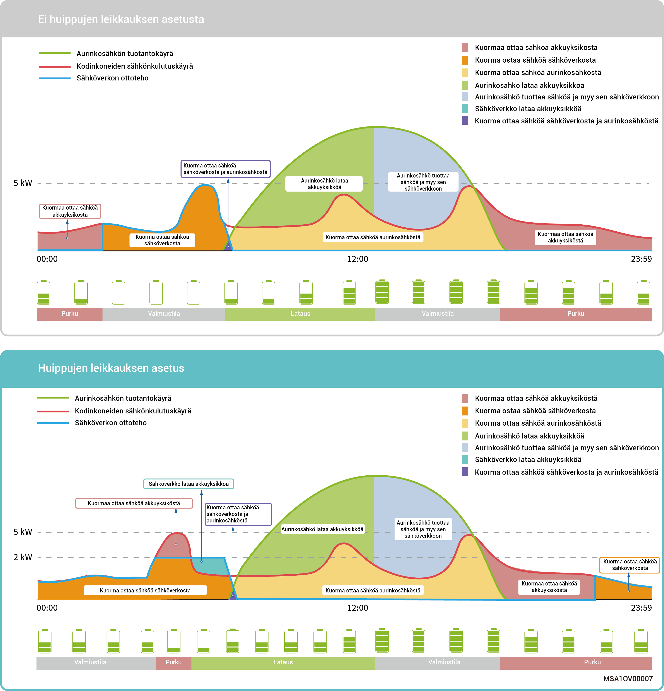
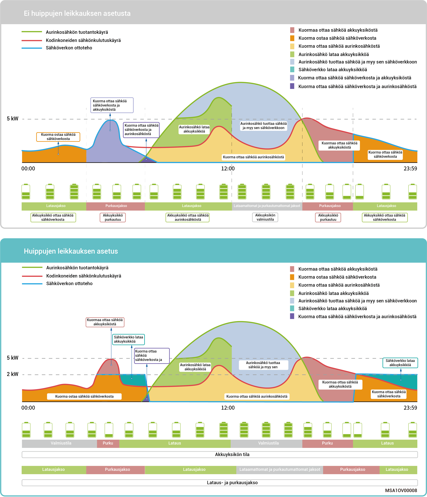

# Huippujen leikkaus

* Sähkölasku lasketaan joillakin alueilla seuraavasti: Sähkölaskun kokonaissumma = huipputehon hinta + sähkönkulutuksen hinta + muut kustannukset. Huipputeho tarkoittaa verkosta otetun sähkön enimmäismäärää. Tämä tila sopii alueille, joilla on sähkön hintapiikkejä ja laskuja ja merkittäviä hintaeroja.
* Huippujen leikkaustoimintoa voidaan käyttää kaikissa käyttötiloissa. Sen avulla voidaan määrittää verkosta otettavan huipputehon enimmäismäärä, jolloin verkosta otettavan huipputehon enimmäismäärä huippuaikoina pienenee ja sähkölasku alenee.

### **Esimerkki 1: Omakulutus-tilan asetukset huippujen leikkaamista varten**

Oletetaan, että huippujen leikkauksen SOC on asetettu 50 %:iin ja huipputehon enimmäismäärä on 2 kW. Koska sähkölaskun kokonaissumma = huipputehon hinta + sähkönkulutuksen hinta + muut kustannukset. Huipputeho tarkoittaa verkosta otetun sähkön enimmäismäärää. Kun omakulutustilan asetukseksi valitaan huippujen leikkaaminen, verkosta ostetun sähkön määrä laskee 5 kW:sta 2 kW:iin, jolloin sähkölaskun kokonaissumma pienenee.

<figure><figcaption></figcaption></figure>

### **Esimerkki 2: Huippujen leikkauksen aikaan perustuvat ohjaustilan asetukset**

Oletetaan, että huippujen leikkauksen SOC on asetettu 50 %:iin ja huipputehon enimmäismäärä on 2 kW. Koska sähkölaskun kokonaissumma = huipputehon hinta + sähkönkulutuksen hinta + muut kustannukset. Huipputeho tarkoittaa verkosta otetun sähkön enimmäismäärää. Kun aikaan perustuvan ohjaustilan asetukseksi valitaan huippujen leikkaaminen, verkosta ostetun sähkön määrä laskee 5 kW:sta 2 kW:iin, jolloin sähkölaskun kokonaissumma pienenee.

<figure><figcaption></figcaption></figure>
