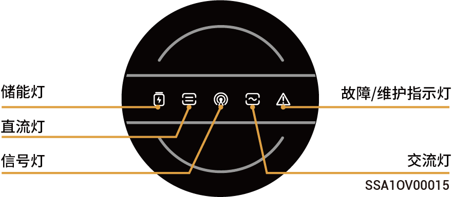
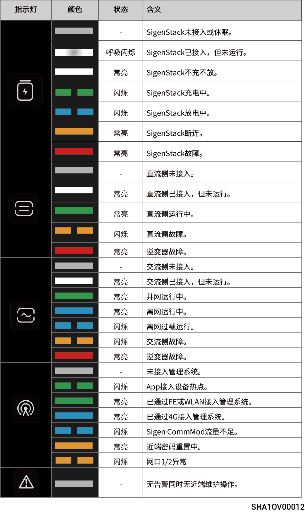

# 指示灯状态

## **逆变器指示灯**



<mark style="color:blue;">指示灯有两种，有黄色指示灯参见灯语一，有蓝色指示灯参见灯语二。</mark>

### 灯语 1

<figure><figcaption></figcaption></figure>

### 灯语 2

<figure><figcaption></figcaption></figure>

## **思格通信棒指示灯**

<figure><figcaption></figcaption></figure>

<table><thead><tr><th width="60.5352783203125" align="center">序号</th><th width="111.78790283203125">名称</th><th width="243.22216796875">状态</th><th>说明</th></tr></thead><tbody><tr><td align="center">1</td><td>电源灯</td><td>-</td><td>-</td></tr><tr><td align="center">2</td><td>网络状态灯</td><td>慢闪（200ms亮/1800ms灭）</td><td>正在连接网络。</td></tr><tr><td align="center">2</td><td>网络状态灯</td><td>慢闪（1800ms亮/200ms灭）</td><td>待机中。</td></tr><tr><td align="center">2</td><td>网络状态灯</td><td>快闪（125ms亮/125ms灭）</td><td>数据传输中。</td></tr></tbody></table>
