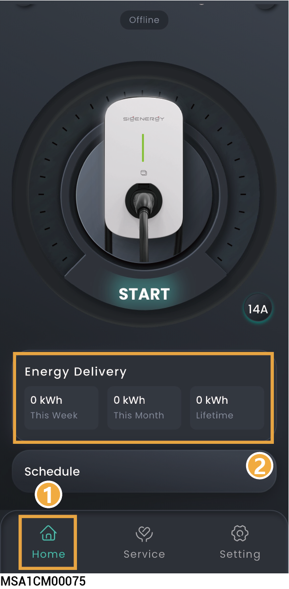

# Device Information

## Sigen Inverter/Battery



* <mark style="color:blue;">When multiple Singrow inverters/batteries are connected to the same power station, swipe left/right or up/down to view each Singrow inverter/battery.</mark>
* <mark style="color:blue;">The SN number displayed in the App matches the SN number on the Singrow inverter/battery label. You can locate the specific Singrow inverter/battery you need to view by its SN number.</mark>

<figure><figcaption></figcaption></figure>

## Sigen EV AC Charger information

Go to the corresponding interface using the following method, and click "Energy Delivery" to view detailed information.

### **Pure charging application**

<figure><figcaption></figcaption></figure>

### **PV charging or PV storage & charging application**

<figure><figcaption></figcaption></figure>

## Alarm information

<figure><figcaption></figcaption></figure>

## Charging Records

### **Pure charging application**

### **PV charging or PV storage & charging application**

