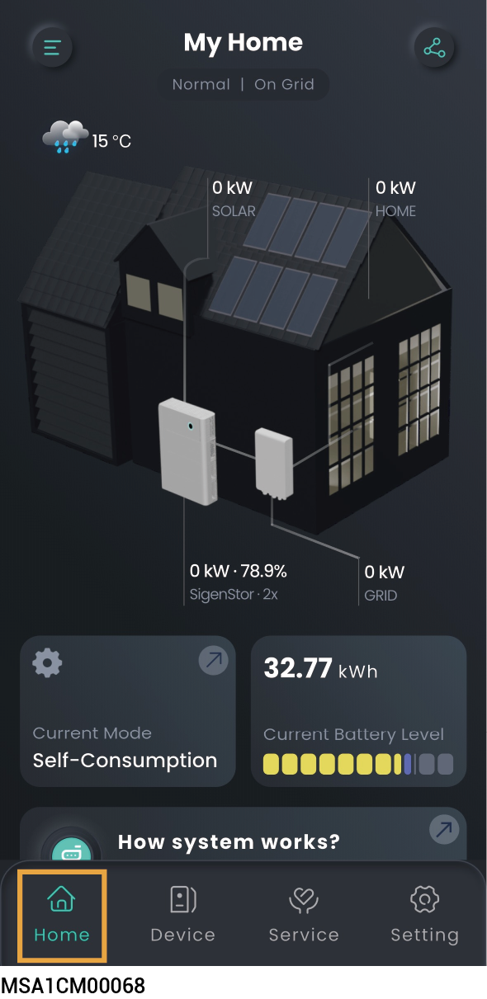
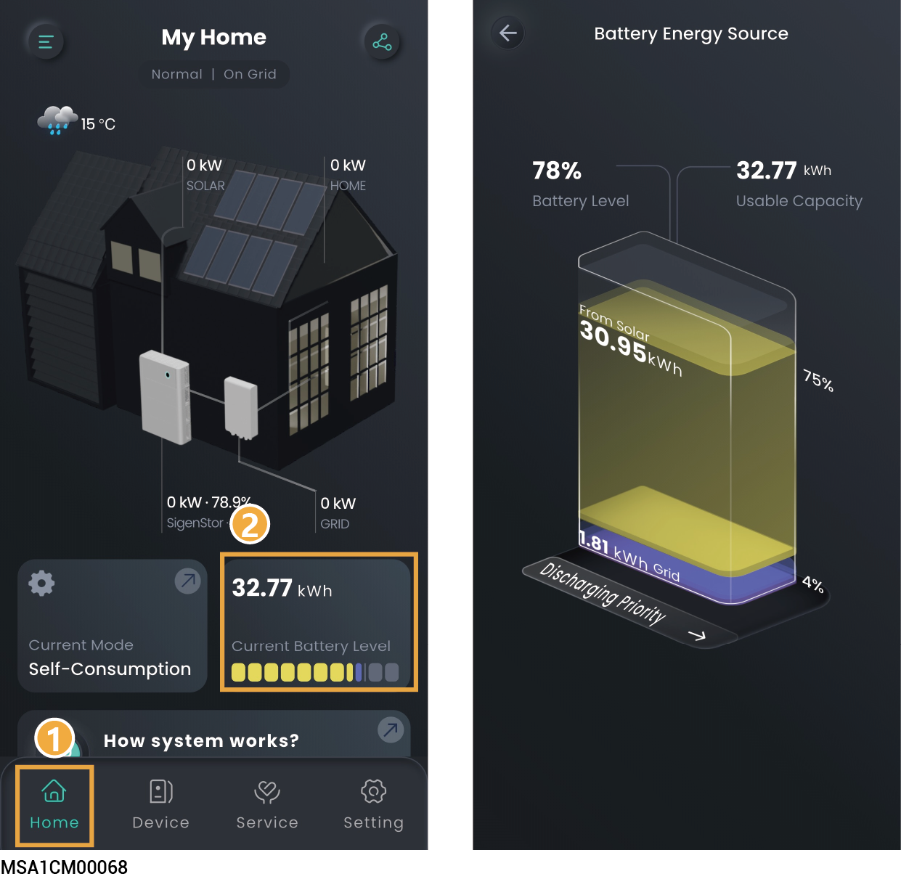
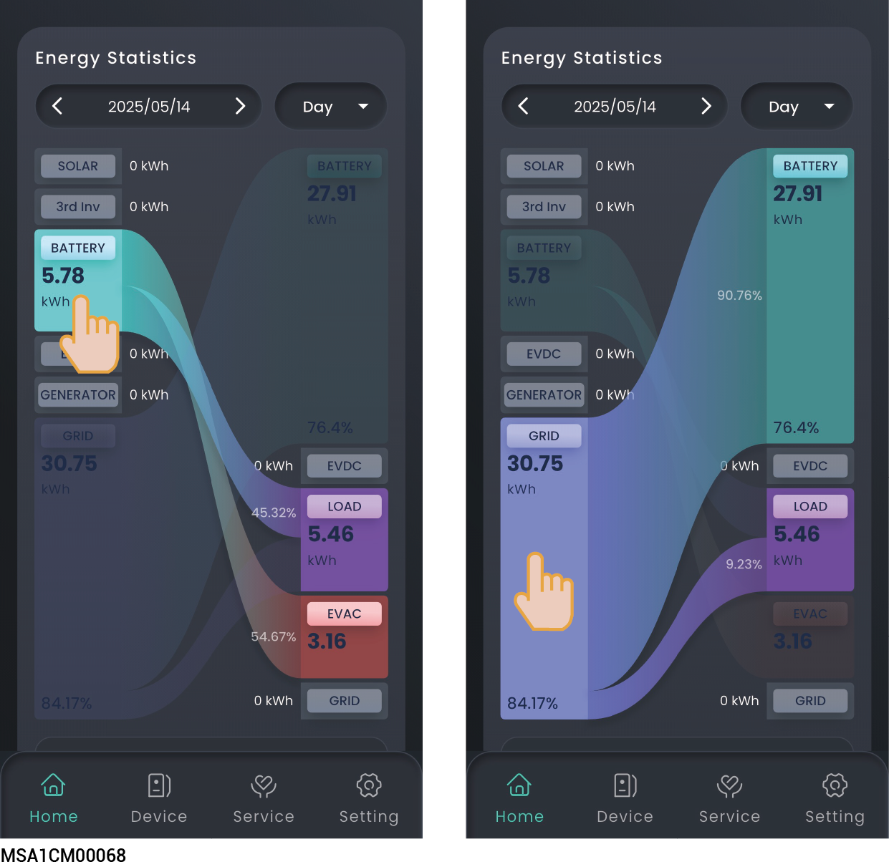
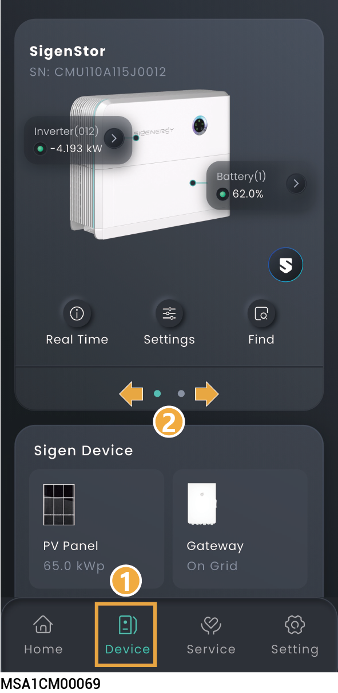
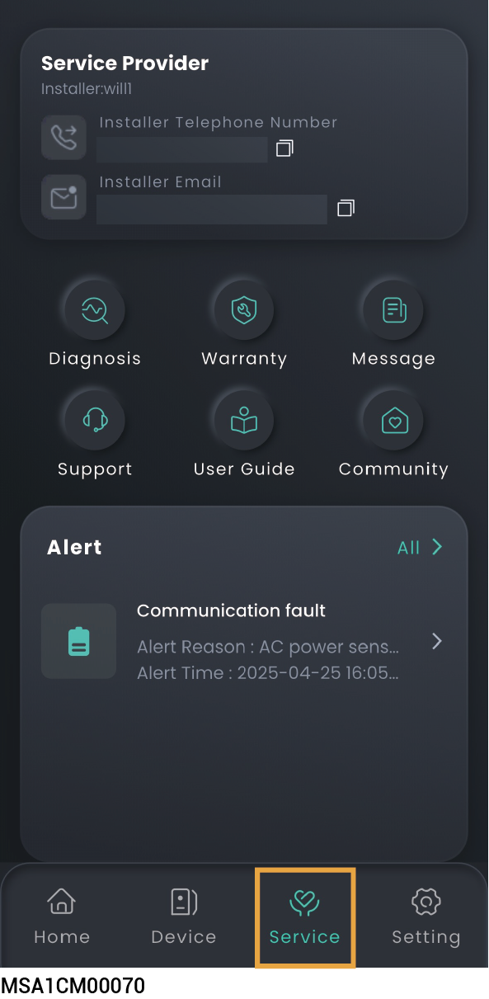
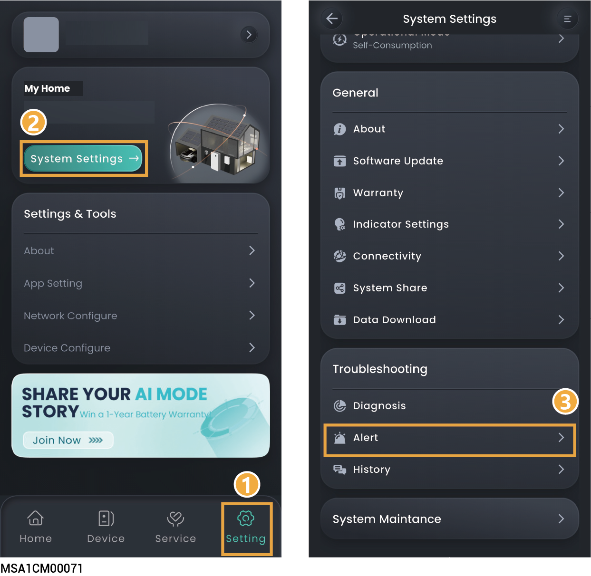
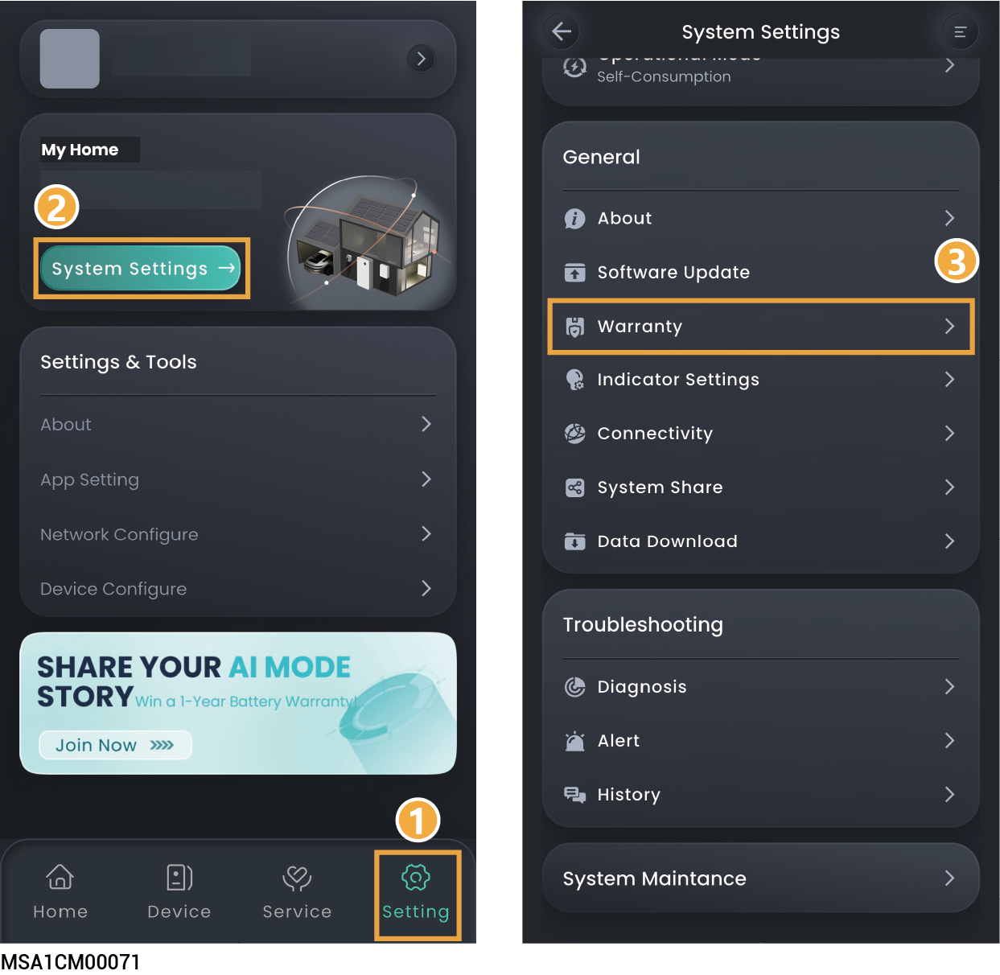

# Station Information

## Operation Information



<mark style="color:blue;">**The Home screen displays running information, You can click**</mark> <mark style="color:blue;">**to share information displayed on the Home screen to others.**</mark>

<figure><figcaption></figcaption></figure>

## **Battery energy source**

<figure><figcaption></figcaption></figure>

## **Energy Analysis**



<mark style="color:blue;">**Click the energy box to view the energy flow.**</mark>

<figure><figcaption></figcaption></figure>

## Operation Information of a Single Unit



<mark style="color:blue;">**In parallel mode, slide left or right, or up and down, to locate the SigenStor you want to view based on the SN.**</mark>

<figure><figcaption></figcaption></figure>

## Alarm information

You can query alarm information using the following two methods.

### Method 1:

<figure><figcaption></figcaption></figure>

### Method 2:

<figure><figcaption></figcaption></figure>

## Warranty Information

### Method 1:

<figure><figcaption></figcaption></figure>

### Method 2:

<figure><figcaption></figcaption></figure>

## User Guide Information

<figure><figcaption></figcaption></figure>
