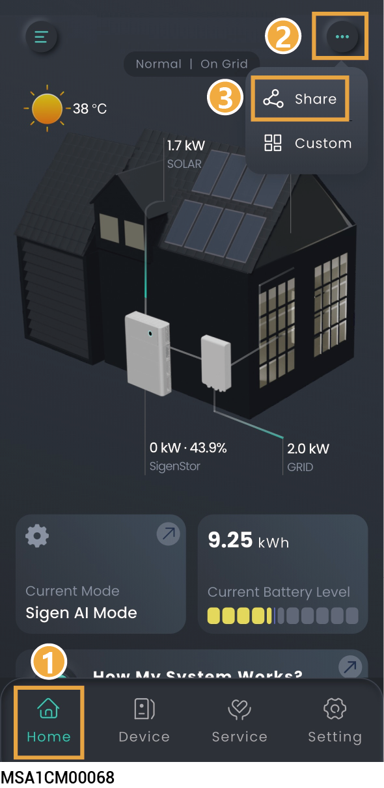
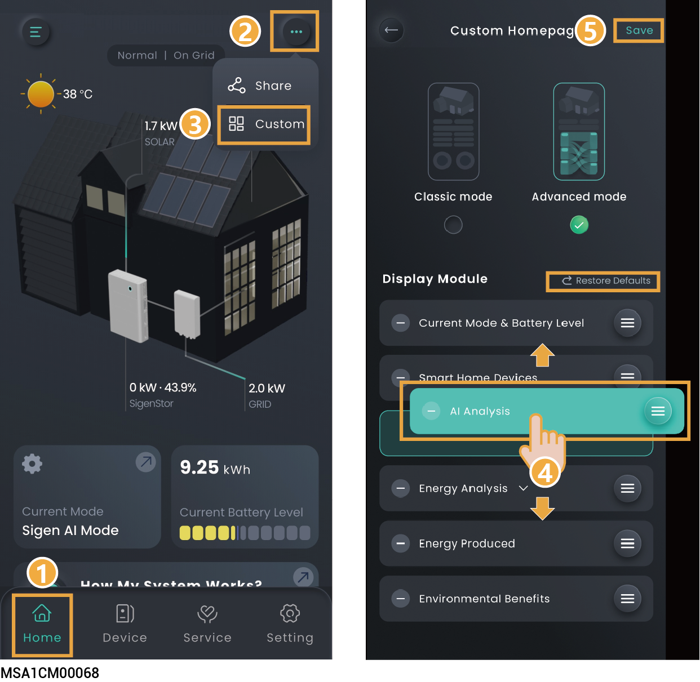
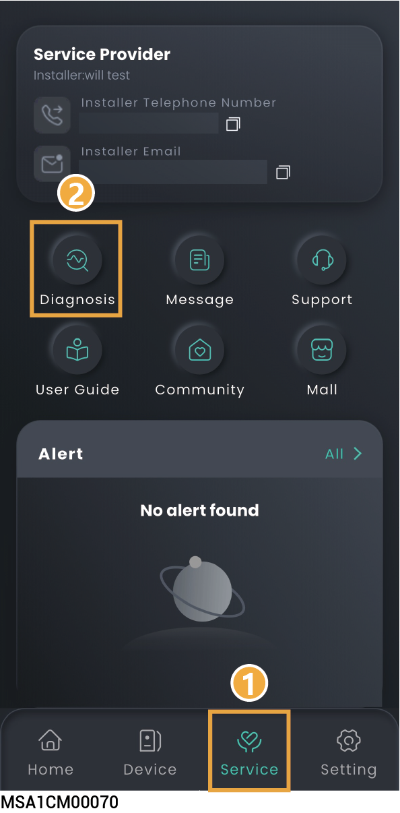

# Station Information

## Operation Information

### **Share Power Station**

The Home screen displays running information, You can click →to share information displayed on the Home screen to others.

<figure><figcaption></figcaption></figure>

### Homepage Customization Settings

* Click → to create a customized homepage layout according to your needs.
* Click 'Restore Defaults' to reset to default settings.

<figure><figcaption></figcaption></figure>

## Battery energy source

<figure><figcaption></figcaption></figure>

## **Energy Analysis**

Click the energy box to view the energy flow.

<figure><figcaption></figcaption></figure>

## Operation Information of a Single Unit



<mark style="color:blue;">In parallel mode, slide left or right, or up and down, to locate the SigenStor you want to view based on the SN.</mark>

<figure><figcaption></figcaption></figure>

## Alarm information

### Method 1:

<figure><figcaption></figcaption></figure>

### Method 2:

<figure><figcaption></figcaption></figure>

## Warranty Information

### Method 1:

<figure><figcaption></figcaption></figure>

### Method 2:

<figure><figcaption></figcaption></figure>

## Station Diagnosis



<mark style="color:$primary;">To check the power station's communication status and the connection status of devices within the station, you can use this function.</mark>

### Method 1: 

<figure><figcaption></figcaption></figure>

### Method 2: 

<figure><figcaption></figcaption></figure>

## User Guide Information

<figure><figcaption></figcaption></figure>
