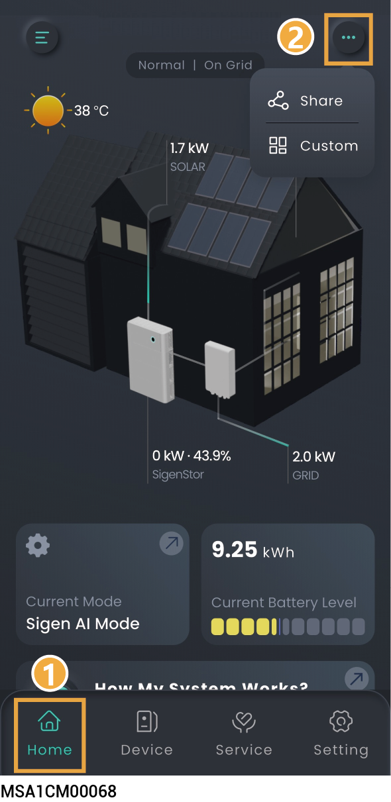
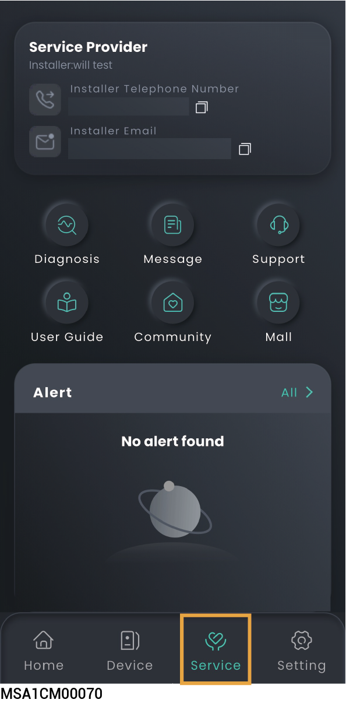

# Station Information

## Operation Information

<figure><figcaption></figcaption></figure>

### **Share Power Station**

The Home screen displays running information, You can click →to share information displayed on the Home screen to others.

### Homepage Customization Settings

* Click → to create a customized homepage layout according to your needs.
* Click 'Restore Defaults' to reset to default settings.

## **Energy Analysis**

Click the energy box to view the energy flow.

<figure><figcaption></figcaption></figure>

## Operation Information of a Single Unit



* <mark style="color:blue;">When multiple Singrow inverters/batteries are connected to the same power station, swipe left/right or up/down to view each Singrow inverter/battery.</mark>
* <mark style="color:blue;">The SN number displayed in the App matches the SN number on the Singrow inverter/battery label. You can locate the specific Singrow inverter/battery you need to view by its SN number.</mark>

<figure><figcaption></figcaption></figure>

## Service Page Information

<figure><figcaption></figcaption></figure>

<table><thead><tr><th width="82" align="center" valign="middle">No.</th><th width="128.8829345703125" valign="middle">Parameter Name</th><th valign="top">说明</th></tr></thead><tbody><tr><td align="center" valign="middle">1</td><td valign="middle">Diagnosis</td><td valign="top">To check the power station's communication status and the connection status of devices within the station, you can use this function.</td></tr><tr><td align="center" valign="middle">2</td><td valign="middle">Message</td><td valign="top">Click to view power station messages.</td></tr><tr><td align="center" valign="middle">3</td><td valign="middle">Support</td><td valign="top"><ul><li>Please feel free to reach out to us in the App if you have any questions about the use of the product.</li></ul><ul><li>To check the question history, click "History" in the upper right corner of the "Support" page.</li></ul></td></tr><tr><td align="center" valign="middle">4</td><td valign="middle">User Guide</td><td valign="top">Click to access the user guide.</td></tr><tr><td align="center" valign="middle">5</td><td valign="middle">Community</td><td valign="top">Click to enter the forum interface. Click "Community" → "Guide Video" to view product installation videos.</td></tr><tr><td align="center" valign="middle">6</td><td valign="middle">Mail</td><td valign="top">Click to purchase products. Click“”View Order History" in the upper right corner.</td></tr></tbody></table>
