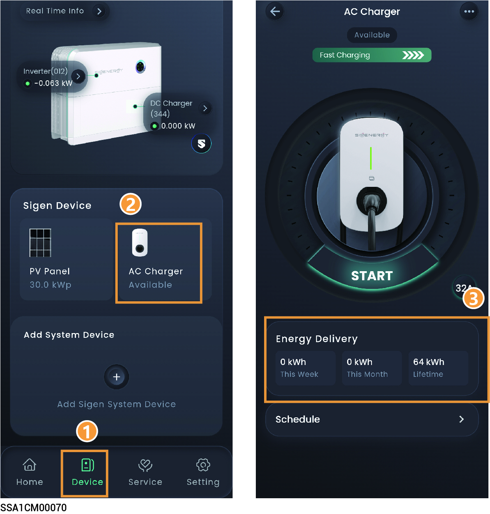
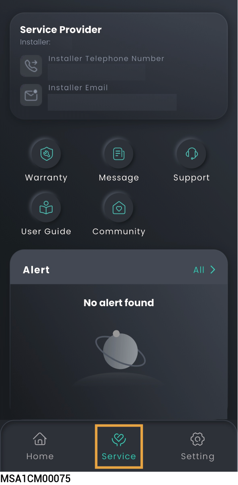
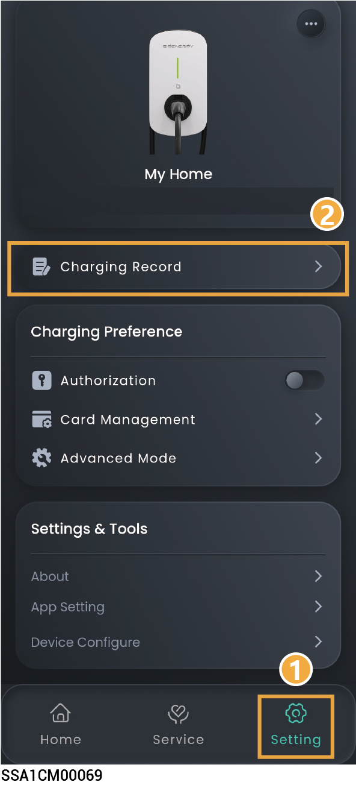
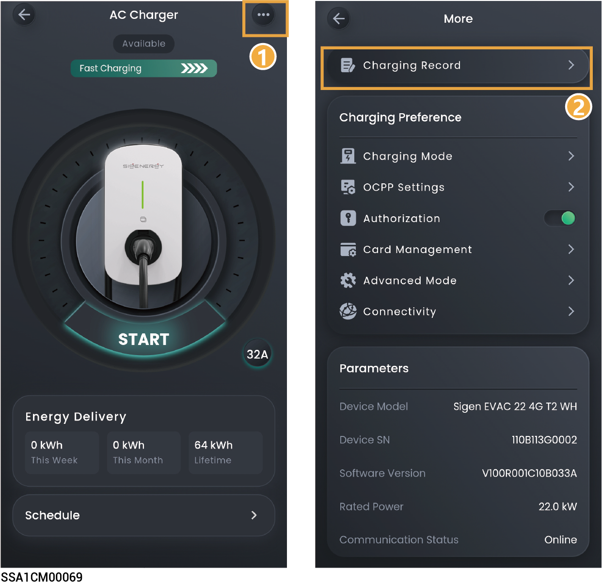

# Sigen EV AC Charger

## Operation Information

<mark style="color:blue;">**Go to the corresponding interface using the following method, and click "Energy Delivery" to view detailed information.**</mark>

### **Pure charging application**

<figure><figcaption></figcaption></figure>

### **PV charging or PV storage & charging application**

You can click to share information displayed on the Home screen to others.

<figure><figcaption></figcaption></figure>

## Alarm information

<figure><figcaption></figcaption></figure>

## Charging Records

### **Pure charging application**

### **PV charging or PV storage & charging application**

