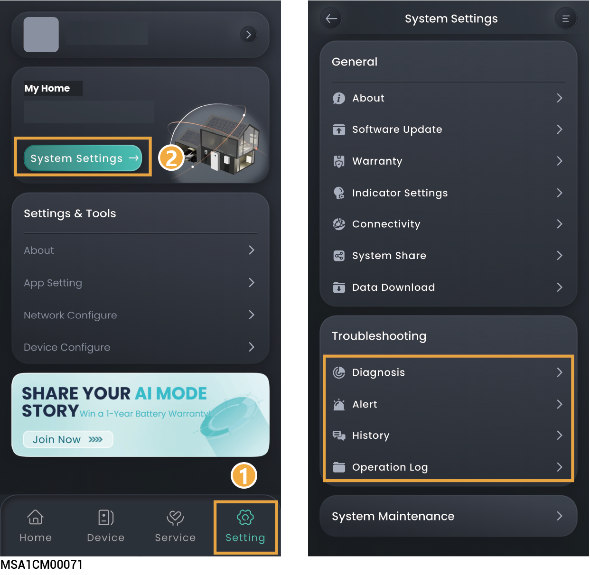

# Trobleshooting

<figure><figcaption></figcaption></figure>

<table><thead><tr><th width="80" align="center" valign="top">No.</th><th width="165.0101318359375" valign="top">Parameter Name</th><th valign="top">Description</th></tr></thead><tbody><tr><td align="center" valign="top">1</td><td valign="top">Diagnosis</td><td valign="top">You can use this feature to check the communication status of the station and connection status of devices in the station.</td></tr><tr><td align="center" valign="top">2</td><td valign="top">Alert</td><td valign="top">Click to view the alarm information of a single power station.</td></tr><tr><td align="center" valign="top">3</td><td valign="top">History</td><td valign="top">Click to view historical work orders.</td></tr><tr><td align="center" valign="top">4</td><td valign="top">Operation Log</td><td valign="top">Click to download the operation records of the power station.</td></tr></tbody></table>
